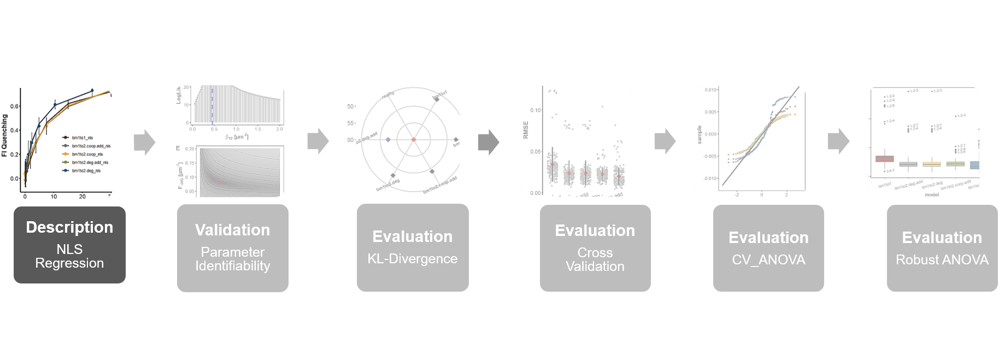
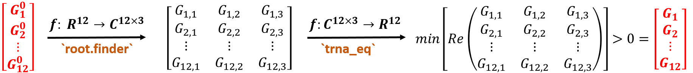

```{css, echo = FALSE}
h1, #TOC>ul>li {
  font-weight: bold;
}

```

```{r setup, include=FALSE}
knitr::opts_chunk$set(echo = TRUE)
knitr::opts_chunk$set(fig.align = 'center')
```

```{r packages, include=TRUE, message=FALSE, warning=FALSE}
library(bookdown)
library(minpack.lm)
library(readxl)
library(dplyr)
library(purrr)
library(tidyr)
library(ggplot2)
library(ggpubr)
library(tibble)
library(ggsci)
library(latex2exp)
library(AICcmodavg)
library(vtreat)
library(kableExtra)
library(broom)
# automatically create a bib database for R packages
knitr::write_bib(c(
  .packages(), 'bookdown', 'knitr', 'rmarkdown'
), 'packages.bib')
```

```{r roadmap, include=TRUE, echo=FALSE, out.width="100%", fig.cap="**Statistical analysis roadmap.** "}

```

# Objective

****
**ThiI<sub>Tm</sub> is characterized by an intrinsic tryptophan fluorescence signal that is quenched in a concentration dependent manner in the presence of its tRNA substrates. This offers the possibility to examine the stoichiometry that underlies ThiI<sub>Tm</sub>•tRNA complexes based on a fluorescence spectroscopic titration experiment using the specific example of the ThiI<sub>Tm</sub>•tRNA$\mathrm{^{Phe}_{Bs}}$ interaction. In this context, unveiling the true underlying stoichiometry is inherently linked to finding the most appropriate binding equilibrium describing the resulting ThiI<sub>Tm</sub>•tRNA$\mathrm{^{Phe}_{Bs}}$ binding profile. In the following Rmarkdown files an analytic workflow is going to be presented on the basis of a comparative multi-model approach that is capable of objectively finding the statistically best approximating binding model of this interaction in a set of alternative binding models with varying complexity that are all related to underlying 1:1 (ThiI<sub>Tm</sub> : tRNA$\mathrm{^{Phe}_{Bs}}$) or 1:2 binding equilibria.**

****

* Measurement set up and data structure are described in section \@ref(fi)
* The set of binding models used to fit the titration profile is detailed in section \@ref(nls)
* Non linear least squares regression analysis is described in section \@ref(nlsImp)
* Major results and conclusions are summarized in sections \@ref(spectroscopy) and \@ref(conclusions)


# Methods
## Tryptophan Fluorescence Spectroscopy {#fi}

* ThiI<sub>Tm</sub>•tRNA$\mathrm{^{Phe}_{Bs}}$ complexation was monitored based on quenching of the intrinsic tryptophan fluorescence of ThiI<sub>Tm</sub>. 
* ThiI<sub>Tm</sub> (5 µM) was titrated with incrementally increasing amounts of tRNA$\mathrm{^{Phe}_{Bs}}$ (0.03-60 µM)
* Fluorescence spectra were recorded as triplicates on a Multimode Plate Reader using appropriate excitation/emission filter 
* Raw fluoresence intensities present in multi-sheet excel file as shown in figure \@ref(fig:exceldata): 

```{r exceldata, include=TRUE, echo=FALSE, out.width="90%", fig.cap="**Raw fluorescence intensities of the titration experiment.** The output format of raw fluorescence intensities was a multi-sheet excel file. Data points were extracted by the read_fi_raw function."}

```

* `read_fi_raw` function was written to extract and read the measurement points (replica1-3) into a data frame 

```{r read_xlsx}
read_fi_raw <- function(data.path, file.index, trna.conc){
  n_rep <- sapply(1:length(file.index), 
                  function(x) paste0("replica", x))
  input.files <- paste0(data.path, "/", list.files(path = data.path)[file.index])
  input.list <- map(input.files, read_excel, skip = 11, col_names = FALSE)
  names(input.list) <- n_rep
  
  input.list1 <- input.list %>% 
    map( function(.x) pivot_longer(.x, c(2:ncol(.x)), values_to = c("fi"))) %>% 
    map(function(.x)  select(.x, fi)) %>% 
    map(function(.x) unique(.x)) %>% 
    map(function(.x) filter(.x, fi != "NA")) %>%
    map_df(`[[`, "fi")
  
  input.list2 <- input.list1 %>%  
    mutate(trna = c(trna.conc,
                    sapply(c(1:(nrow(input.list1)-2)),
                           function(x) trna.conc/2^x), 0))
  return(input.list2)
}

```

* Change in observed fluorescence intensity $\Delta F_{obs}$ for each replica was averaged (avg_fi column) and transformed to reflect the proportional signal quenching (que_fi column) according to:

\begin{equation}
\Delta F_{obs,i} = \frac{\Delta F_{obs,max} - \Delta F_{obs,i}}{\Delta F_{obs,max}}
(\#eq:quench)
\end{equation}

* where $\Delta F_{obs,max}$ is the maximum achievable signal provided by the negative control (baseline signal, `fi_baseline`) when no tRNA induced signal quenching occurs.
* stdev and trna, respectively, represent standard deviation and tRNA concentration

```{r raw_data, message=FALSE}
fi_raw <- read_fi_raw(data.path = "RawData/FluorescenceSpec",
                      file.index =  c(2,4,5),
                      trna.conc = 30)
fi_raw_mean <- fi_raw %>% 
  rowwise() %>%   
  mutate(avg_fi = mean(c(replica1,
                         replica2,
                         replica3))) %>% 
  filter(trna != 0) %>% 
  select(-trna)


fi_raw_list <- fi_raw %>% 
  select(-trna) %>% 
  as.list()

fi_baseline <- fi_raw_list %>% 
  map(~last(.x))

fi <- map2_df(fi_raw_list, fi_baseline, function(.x, .y) (.y - .x) / .y) %>% 
  rowwise() %>% 
  mutate(que_fi = mean(c(replica1,
                         replica2,
                         replica3)),
         stdev = sd(c(replica1,
                      replica2,
                      replica3))) %>% 
  ungroup() %>% 
  mutate(trna = fi_raw$trna) %>% 
  filter(trna != 0)%>% 
  select(trna, que_fi, stdev) 
  cbind(fi_raw_mean, fi)
```

* Obtained binding isotherm (que_fi as a function of trna) was fitted by nls regression as described in \@ref(nls). 

## Non-Linear Least Squares Analysis of Binding Isotherms {#nls}

* Binding isotherms obtained from \@ref(fi) analyzed via ordinary nls regression 
* Based on Levenberg-Marquardt algorithm implemented in the nlsLM() function 
* Comparative fitting of different binding equilibria describing ThiI:tRNA binding stoichiometries of 1:1 or 1:2 
* All 1:2 binding models (\@ref(eq:coop), \@ref(eq:coopadd), \@ref(eq:deg), and \@ref(eq:degadd)) describe sequential tRNA binding to independent binding sites of ThiI<sub>Tm</sub>. 
* Model functions assume that quenching of tryptophan fluorescence signal is of an entirely static nature due to a specific ThiI<sub>Tm</sub>•tRNA$\mathrm{^{Phe}_{Bs}}$ interaction rather than due to unspecific collisions
* focus was on binding models that do neither approximate free ligand concentration nor assume simultaneous ligand binding
* every model function derived based on the appropriate binding equilibrium by taking into account the law of mass conservation
* the global binding model referred to as the `bm1to2.coop` model described by equation \@ref(eq:coop):

\begin{equation}
\Delta F_{obs}=\frac{[H]_0\left(F_{\Delta HG}\,K_1[G]+F_{\Delta HG2}\,K_1K_2[G]^2\right)}{1+K_1[G]+K_1K_2[G]^2}
(\#eq:coop)
\end{equation}

```{r globalModel}
bm1to2.coop <- function(fhg, fhg2, k1, k2, g0){
  5 * (fhg * k1 * g0 + fhg2 * k1 * k2 * g0^2) / (1 + k1 * g0 + k1 * k2 * g0^2)}
```

* where $[H]_0$ = total concentration of Host (ThiI), $[G]$ = concentration of free Guest (tRNA) at equilibrium, $F_{\Delta HG}$/$F_{\Delta HG2}$ = proportionality factors relating the change in fluorescence signal ($\Delta F_{obs}$) to the concentration of the complex having one or two guests bound, respectively, and $K_1$/$K_2$ = macroscopic binding constants of the first and second binding step, respectively. 
* Binding model accounts for cooperativity which can explicitly be described by the interaction parameter $\alpha$ according to equation \@ref(eq:alpha):

\begin{equation}
\mathrm{\alpha=\frac{K_1}{4K_2}=}
\begin{cases}
>1 & \text{positive coop.}\\
1 & \text{no coop.}\\
<1 & \text{negative coop.}

\end{cases}
(\#eq:alpha)
\end{equation}

* Equation \@ref(eq:coop) can be re-parameterized in different ways yielding nested 1:2 binding models having more degrees of freedom. 
* Assuming additivity of proportionality factors ($F_{\Delta HG2}$ = 2$F_{\Delta HG}$), equation \@ref(eq:coop) reduces to the `bm1to2.coop.add` ("cooperative/additive model") described by equation \@ref(eq:coopadd):

\begin{equation}
\Delta F_{obs}=\frac{[H]_0\,F_{\Delta HG}\left(K_1[G]+2K_1K_2[G]^2\right)}{1+K_1[G]+K_1K_2[G]^2}
(\#eq:coopadd)
\end{equation}

```{r coopadd}
bm1to2.coop.add <- function(fhg, k1, k2, g0){
  5 * (fhg * (k1 * g0 + 2 * k1 * k2 *g0^2)) / (1 + k1 * g0 + k1 * k2 * g0^2)}
```

* Assuming non-cooperativity between the binding sites (degenerate binding sites), then $K_1$ = 4$K_2$ according to equation \@ref(eq:alpha). 
* Binding constants can then be combined to one overall stability constant $\beta_{12}$ = $K_1K_2$ 
* Then equation \@ref(eq:coop) simplifies to the "degenerate/non-additive model" `bm1to2.deg` given by equation \@ref(eq:deg): 

\begin{equation}

\Delta F_{obs}=\frac{[H]_0 \left(F_{\Delta HG}\,2\sqrt{\beta_{12}}\,[G]+F_{\Delta HG2}\,\beta_{12}[G]^2\right)}{1+2\sqrt{\beta_{12}}\,[G] +\beta_{12}[G]^2}

(\#eq:deg)
\end{equation}

```{r deg}
bm1to2.deg <- function(fhg, fhg2, k1, g0){
  5 * (fhg * k1 * g0 + fhg2 * k1 *(k1 / 4) * g0^2) / (1 + k1 * g0 + k1 * (k1 / 4) * g0^2)}
```

* Assuming non-cooperativity between binding sites and additivity between proportionality factors, equation \@ref(eq:coop) reduces to the most simple "degenerate/additive model" `bm1to2.deg.add` described by equation \@ref(eq:degadd):

\begin{equation}
\Delta F_{obs}=\frac{[H]_0\, F_{\Delta HG}\left(2\sqrt{\beta_{12}}\,[G]+2\beta_{12}[G]^2\right)}{1+2\sqrt{\beta_{12}}\,[G] +\beta_{12}[G]^2}
(\#eq:degadd)
\end{equation}

```{r degadd}
bm1to2.deg.add <- function(fhg, k1, g0){
  5 * (fhg * (k1 * g0 + 2 * k1 * (k1 / 4) * g0^2)) / (1 + k1 * g0 + k1 * (k1 / 4) * g0^2)}
```

* Every 1:2 binding model depends on free guest concentration $[G]$ 
* $[G]$ was derived from the corresponding total (starting) concentration $[G]_0$ used in each titration step of the binding experiment 
* Accomplished by solving the cubic polynomial in equation \@ref(eq:cubic) having the coefficients $A$, $B$, $C$, and $D$ given below:

\begin{gather}
\mathrm{(A)[G]^3+(B)[G]^2+(C)[G]-D=0} \quad \text{,with}\\
\mathrm{A=K_1K_2} \notag\\
\mathrm{B=K_1(2K_2[H]_0-K_2[G]_0+1)} \notag\\
\mathrm{C=K_1([H]_0-[G]_0)+1} \notag\\
\mathrm{D=[G]_0} \notag
(\#eq:cubic)
\end{gather}

* Cubic solved in R by the `root.finder` function (see code chunk below) 
* Generally, $[H]_0$ was treated as a constant and set to 5 $\mu$m for all fitting routines 
* For a given vector of 12 starting concentrations $\overrightarrow{G}_0$ and a set of parameter values ($K_1$, $K_2$) this function yields at most three solutions for every entry of the vector $\overrightarrow{G}_0$ which might be positive, negative, or complex 
* The `trna_eq` function was then used to extract the smallest positive real roots of the polynomial so that a vector of 12 equilibrium concentrations $\vec{G}$ was obtained 

```{r rootfinder, include=TRUE, echo=FALSE, out.width="90%", fig.cap="**Solving the cubic polynomial.** For a vector of 12 starting concentrations $\\overrightarrow{G}_0$ and a set of {${K_1,K_2}$} values the `root.finder` function solves the cubic polynomial resulting in a 12 $\\times$ 3 matrix of solutions that could be positive, negative, or complex, respectively. The `trna_eq` function then finds the smallest positive real roots of this matrix so that a vector of 12 equilibrium concentrations $\\overrightarrow{G}$ is obtained."}

```


```{r trna_concentration}
root.finder <- function(constants = c(k1 = 0, k2 = 0, h0 = 0), g0){
  A <- constants[1] * constants[2]
  B <- 2*constants[1] * constants[2] * constants[3] - 
    constants[1] * constants[2] * g0 + constants[1]
  C <- constants[1] * constants[3] - constants[1] * g0 + constants[1]
  D <- -g0
  cube.solv <- polyroot(c(D,C,B,A))
  return(cube.solv)
}

trna_eq <- function(constants = c(k1 = 0, k2 = 0, h0 = 0), g0){
  b1 <- sapply(g0, function(x) root.finder(constants, x))
  find_zero_imaginary <- sapply(b1, function(x) round(Im(x),digits = 6) == 0)
  b2 <- b1[find_zero_imaginary]
  find_positive_real <- sapply(b2, function(x) Re(x) > 0)
  b3 <- b2[find_positive_real]
  b3 <- Re(b3)
  return(b3)
}
```

* 1:1 binding model `bm1to1` completing the set described by equation \@ref(eq:simple):

\begin{equation}
\mathrm{ \Delta F_{obs}=F_{\Delta HG} \left(\frac{1}{2}\left\{ \left([H]_0+[G]_0+\frac{1}{K_1}\right)-\sqrt{\left([H]_0+[G]_0+\frac{1}{K_1}\right)^2-4[H]_0[G]_0}  \right\} \right)}
(\#eq:simple)
\end{equation}

```{r simple}
bm1to1 <- function(fhg,k1,g0){
  fhg * (((g0 + 5 + (1 / k1)) - sqrt((g0 + 5 + (1 / k1))^2 - 4 * 5 * g0)) / 2)}
```

## Implementation of the nls fitting routine {#nlsImp}

* In case of the two-site binding models predicted values $\Delta F_{obs}$ as well as the explanatory variable $[G]$ are dependent on the parameter values of $K_1$ and $K_2$ which are supposed to be optimized
* Each iteration of the Levenberg-Marquardt algorithm (the nlsLM() function) would yield a different vector of the equilibrium concentration of the tRNA ($\vec{G}$) 
* This parameter dependent change of the explanatory varibale not accounted for by the generic nlsLM() function
* Two wrapper functions were written:
  + `var_nls_deg` for the two degenerative binding models  
  * `var_nls_coop` for the two cooperative binding models  
* Core structure schematically depicted in figure \@ref(fig:nlsLoop) 
* The var_nls_*() functions take the same arguments as the nlsLM() function 
* During initialization phase the point estimates of $K_1$ and $K_2$ are firstly found based on the vector of starting concentrations $\overrightarrow{G}_0$ (`start.conc`) 
* During while loop structure the `trna_eq` function is applied to find the vector of equilibrium tRNA concentrations $\overrightarrow{G}$ given the initially found point estimates of $K_1$ and $K_2$
* The $\overrightarrow{G}$ vector is then used as the new explanatory variable and the binding models are re-optimized 
* Obtained $RMSE$ ($RMSE_{new}$) is compared to the $RMSE$ of the previous iteration ($RMSE_{curr}$) until no further improvement is made

```{r nlsDeg}
var_nls_deg <- function(..., start.conc){
  nls.model <- nlsLM(...)
  
  g.current <- start.conc
  k1.current <- as.numeric(coef(nls.model)["k1"])
  # max.iter <- 0
  sigma.new <- 2
  sigma.curr <- 1
  sigma.it <- c(sigma(nls.model) + 1, sigma(nls.model))
  results <- list()
  results$sigma.model[[1]] <- sigma(nls.model)   
  results$k1[[1]] <- k1.current
  results$trna.conc[[1]] <- g.current
  
  while(sigma.it[sigma.curr] >= sigma.it[sigma.new]){
    if(length(coef(nls.model)) == 2){ 
      model.loop <- nlsLM(que_fi ~ bm1to2.deg.add(fhg, k1, g.current),
                          data = fi,
                          start = list(fhg = as.numeric(coef(nls.model)["fhg"]),
                                       k1 = k1.current))
    } else {
      model.loop <- nlsLM(que_fi ~ bm1to2.deg(fhg, fhg2, k1, g.current),
                          data = fi,
                          start = list(fhg = as.numeric(coef(nls.model)["fhg"]),
                                       fhg2 = as.numeric(coef(nls.model)["fhg2"]),
                                       k1 = k1.current))
    }
    
    sigma.curr <- sigma.curr +1
    sigma.new <- sigma.new +1
    sigma.it <- c(sigma.it, sigma(model.loop))
    g.current <- trna_eq(constants = c(coef(model.loop)["k1"], 
                                       coef(model.loop)["k1"]/4, 
                                       5),
                         start.conc)
    k1.current <- as.numeric(coef(model.loop)["k1"])
    print(sigma(model.loop))
    
    results$sigma.model[[sigma.curr]] <- sigma(model.loop)
    results$k1[[sigma.curr]] <- k1.current
    results$trna.conc[[sigma.curr]] <- g.current
    
  }
  
  #selector <- which(results$sigma.model == min(results$sigma.model)) - 1 
  selector <- which(unlist(results$sigma.model) == min(unlist(results$sigma.model))) -1
  g.best <- unlist(results$trna.conc[selector])
  k1.best <- unlist(results$k1[selector])
  ###
  results.list <- list()
  if(length(coef(nls.model)) == 2){
    nls.model.best <- nlsLM(
      que_fi ~ bm1to2.deg.add(fhg, k1, g0 = g.best),
      data = fi,
      start = list(fhg = as.numeric(coef(nls.model)["fhg"]),
                   k1 = k1.best))
    
    results.list <- list(bm1to2.deg.add = nls.model.best,
                         g = g.best) 
    
  } else {
    nls.model.best <- nlsLM(que_fi ~ bm1to2.deg(fhg, fhg2, k1, g.best),
                            data = fi,
                            start = list(fhg = as.numeric(coef(nls.model)["fhg"]),
                                         fhg2 = as.numeric(coef(nls.model)["fhg2"]),
                                         k1 = k1.best))
    results.list <- list(bm1to2.deg = nls.model.best,
                         g = g.best) 
    
  }
  
}
```

```{r nlsCoop}
var_nls_coop <- function(..., start.conc){
  nls.model <- nlsLM(...)
  
  g.current <- start.conc
  k1.current <- as.numeric(coef(nls.model)["k1"])
  k2.current <- as.numeric(coef(nls.model)["k2"])
  # max.iter <- 0
  sigma.new <- 2
  sigma.curr <- 1
  sigma.it <- c(sigma(nls.model) + 1, sigma(nls.model))
  results <- list()
  results$sigma.model[[1]] <- sigma(nls.model)   
  results$k1[[1]] <- k1.current
  results$k2[[1]] <- k2.current
  results$trna.conc[[1]] <- g.current
  
  while(sigma.it[sigma.curr] >= sigma.it[sigma.new]){
    if(length(coef(nls.model)) == 3){ 
      model.loop <- nlsLM(que_fi ~ bm1to2.coop.add(fhg, k1, k2, g.current),
                          data = fi,
                          start = list(fhg = as.numeric(coef(nls.model)["fhg"]),
                                       k1 = k1.current,
                                       k2 = k2.current))
    } else {
      model.loop <- nlsLM(que_fi ~ bm1to2.coop(fhg, fhg2, k1, k2, g.current),
                          data = fi,
                          start = list(fhg = as.numeric(coef(nls.model)["fhg"]),
                                       fhg2 = as.numeric(coef(nls.model)["fhg2"]),
                                       k1 = k1.current,
                                       k2 = k2.current))
    }
    sigma.curr <- sigma.curr +1
    sigma.new <- sigma.new +1
    sigma.it <- c(sigma.it, sigma(model.loop))
    g.current <- trna_eq(constants = c(coef(model.loop)["k1"], 
                                       coef(model.loop)["k2"], 
                                       5),
                         start.conc)
    k1.current <- as.numeric(coef(model.loop)["k1"])
    k2.current <- as.numeric(coef(model.loop)["k2"])
    
    print(sigma(model.loop))
    results$sigma.model[[sigma.curr]] <- sigma(model.loop)
    results$k1[[sigma.curr]] <- k1.current
    results$k2[[sigma.curr]] <- k2.current
    results$trna.conc[[sigma.curr]] <- g.current
    
  }
  
  #selector <- which(results$sigma.model == min(results$sigma.model)) - 1 
  selector <- which(unlist(results$sigma.model) == min(unlist(results$sigma.model))) -1
  g.best <- unlist(results$trna.conc[selector])
  k1.best <- unlist(results$k1[selector])
  k2.best <- unlist(results$k2[selector])
  results.list <- list()
  
  if(length(coef(nls.model)) == 3){
    nls.model.best <- nlsLM(que_fi ~ bm1to2.coop.add(fhg, k1, k2, g.best),
                            data = fi,
                            start = list(fhg = as.numeric(coef(nls.model)["fhg"]),
                                         k1 = k1.best,
                                         k2 = k2.best))
    results.list <- list(bm1to2.coop.add = nls.model.best,
                         g = g.best) 
  } else {
    nls.model.best <- nlsLM(que_fi ~ bm1to2.coop(fhg, fhg2, k1, k2, g.best),
                            data = fi,
                            start = list(fhg = as.numeric(coef(nls.model)["fhg"]),
                                         fhg2 = as.numeric(coef(nls.model)["fhg2"]),
                                         k1 = k1.best,
                                         k2 = k2.best))
    results.list <- list(bm1to2.coop = nls.model.best,
                         g = g.best) 
  }
}
```


```{r nlsLoop, include=TRUE, echo=FALSE, out.width="90%", fig.cap="**Extension of the basic nlsLM() function in order to fit two-site binding models.** Shown is a schematic representation of the core while loop structure of the var_nls_*() functions designed to handle optimizations of models where the explanatory variable itself is changing with the parameter to be optimized. Descriptions are given in the text."}

```

# Major Results
## Fluorescence Spectroscopic Binding Studies{#spectroscopy}

* Figure \@ref(fig:titration)A highlights raw fluorescence intensities as a function of tRNA$\mathrm{^{Phe}_{Bs}}$ concentration obtained from tryptophan spectroscopic titration experiment as described in \@ref(spectroscopy)
* Figure \@ref(fig:titration)B shows for the average fluorescence intensity of the 12 data points across replicates the proportional signal quenching caused by presence of increasing amounts of tRNA$\mathrm{^{Phe}_{Bs}}$ obtained by applying equation \@ref(eq:quench)
* Error bars represent standard deviations
* Scatter plots exhibit a typical hyperbolic shape as a result of an increasing tryptophan fluorescence quenching with increasing concentrations of tRNA$\mathrm{^{Phe}_{Bs}}$
* Error bars illustrate an increasing measurement uncertainty in the data points with an increasing dilution factor of the tRNA$\mathrm{^{Phe}_{Bs}}$ concentration.
* Interaction profile was the basis for nls regression analysis
* The following set of five binding models derived in \@ref(nls) was used for regression analysis:
  + **`bm1to1`**
  + **`bm1to2.deg.add`** describing binding to independent and degenerate binding sites with additive proportionality factors
  + **`bm1to2.deg`** describing binding to independent and degenerate binding sites
  + **`bm1to2.coop.add`** describing binding to independent and cooperative binding sites with additive proportionality factors
  + **`bm1to2.coop`** describing binding to independent and cooperative binding sites
* Best fit regression curves of each binding model shown as line plots

```{r nls, warning=FALSE, results='hide'}

bm1to1_nls <- list()
bm1to1_nls$bm1to1 <- nls(que_fi ~ bm1to1(fhg, k1, g0 = trna),
                         data = fi,
                         start = list(fhg = 0.164223,
                                      k1 = 0.280638))

bm1to2.deg.add_nls <- var_nls_deg(que_fi ~ bm1to2.deg.add(fhg, k1, trna),
                                  data = fi,
                                  start = list(fhg = 0.0944,
                                               k1 = 0.133),
                                  start.conc = fi$trna)

bm1to2.deg_nls <- var_nls_deg(que_fi ~ bm1to2.deg(fhg, fhg2, k1, trna),
                              data = fi,
                              start = list(fhg = 1.25,
                                           fhg2 = -8.0,
                                           k1 = 0.00355),
                              start.conc = fi$trna)

bm1to2.coop.add_nls <- var_nls_coop(que_fi ~ bm1to2.coop.add(fhg, k1, k2, trna),
                                    data = fi,
                                    start = list(fhg = 0.087,
                                                 k1 = 5.9,
                                                 k2 = 0.84),
                                    start.conc = fi$trna)

bm1to2.coop_nls <- var_nls_coop(que_fi ~ bm1to2.coop(fhg, fhg2, k1, k2, trna),
                                data = fi,
                                start = list(fhg = 0.087,
                                             fhg2 = 0,
                                             k1 = 5.9,
                                             k2 = 0.84),
                                start.conc = fi$trna)
nls_reg <- list()
nls_reg$bm1to1_nls <- bm1to1_nls
nls_reg$bm1to1_nls$g <- fi$trna
nls_reg$bm1to2.deg.add_nls <- bm1to2.deg.add_nls
nls_reg$bm1to2.deg_nls <- bm1to2.deg_nls
nls_reg$bm1to2.coop.add_nls <- bm1to2.coop.add_nls
nls_reg$bm1to2.coop_nls <- bm1to2.coop_nls
```

```{r titration, fig.height=4, fig.cap="**Intrinsic tryptophan fluorescence quenching asssay**.  ThiI<sub>Tm</sub> was titrated with increasing amounts of tRNA$^{Phe}_{Bs}$ and the decrease of the intrinsic tryptophan fluoresence of ThiI<sub>Tm</sub> was monitored spectrophotometrically. The titration profile was the basis for nls regression analysis. Different two-site and one-site binding models were fitted all capturing the hyperbolic progress of the binding profile with only subtle differences. **A:** Raw data. Shown is the decrease in the tryptophan fluorescence signal for each of the replicate measurements. The mean FI signal was then transformed to reflect the proportional FI signal quenching. **B:** Two-site binding models were fitted to unique sets of free ligand concentrations $[G]$ individually calculated for each binding model. The remaining one-site binding model was fitted based on total ligand concentration $[G]_0$ as specified in the titration experiment."}

# Helper function
mytheme_axes_grids =
  theme_bw()+
  theme(axis.ticks.length=unit(.07, "cm"))+
  theme(axis.ticks = element_line(colour = "black", size = 1))+
  theme(axis.text.y = element_text(color="black",size = 12))+
  theme(axis.text.x = element_text(color="black",size = 12))+
  theme(axis.title.y = element_text(size = 14,face = "bold"))+
  theme(axis.title.x = element_text(size = 14,face = "bold"))+
  theme(panel.grid.minor=element_blank(),
        panel.grid.major=element_blank(),
        panel.border = element_blank(),
        axis.line.x = element_line(size = 1, colour = "black"),
        axis.line.y = element_line(size = 1, colour = "black"))


nls_reg_pred <- nls_reg %>% 
  map(`[[`, 1) %>% 
  map(~ predict(.x))

nls_reg_resid <- nls_reg %>% 
  map(`[[`, 1) %>% 
  map(~ resid(.x))

nls_reg_trna <- nls_reg %>% 
  map(`[[`, 2)

nls_reg_names <- rep(c(names(nls_reg)), each = 12)
que_fi <- rep(fi$que_fi, times = 5)
stdev <- rep(fi$stdev, times = 5)

model_predict_tbl<- tibble(fi_pred = nls_reg_pred,
                           fi_resid = nls_reg_resid,
                           trna = nls_reg_trna) %>% 
  unnest(cols = c("fi_pred", "fi_resid", "trna")) %>% 
  mutate(model = nls_reg_names,
         que_fi = que_fi,
         stdev = stdev) 

plot1 <- ggplot(model_predict_tbl, aes(x = trna, 
                                       y = que_fi, 
                                       color = model))+
  geom_point(size = 2.5)+
  geom_line(aes(y = fi_pred), size = 1)+
  geom_errorbar(aes(ymin = que_fi - stdev,
                    ymax = que_fi + stdev),
                width = 0.3,
                size = 0.8,
                color = "grey20",
                alpha = 0.3)+
  ylab(TeX("FI Quenching", bold = TRUE))+
  xlab(expression(bold(tRNA[Bs]^{Phe}~"[µM]")))+
  scale_color_uchicago()+
  mytheme_axes_grids+
  theme(legend.title = element_blank(),
        legend.position = c(0.7,0.35))

plot3 <- fi_raw %>% 
  pivot_longer(-trna, names_to = "Replicate", values_to = "fi") %>%
  mutate(fi = fi / 10^5) %>% 
  ggplot(aes(x = trna, y = fi, color = Replicate))+
  geom_point(size = 2.5)+
  ylab(TeX("FI $\\times 10^{-5}$ $\\[ AU \\]$",
           bold = TRUE))+
  xlab(expression(bold(tRNA[Bs]^{Phe}~"[µM]")))+
  scale_color_nejm()+
  mytheme_axes_grids+
  theme(legend.title = element_blank(),
        legend.position = c(0.8,0.8))

ggarrange(plot3, plot1, 
          labels = c("A", "B"),
          ncol = 2, nrow = 1)

```

* All regression curves elevate in a hyperbolic progression in accordance with the titration profile
* Optimization algorithm needed to be extended to fit two-site binding models dependent on free tRNA$\mathrm{^{Phe}_{Bs}}$ concentration at equilibrium ($[G]$) as detailed in section \@ref(nlsImp)
* Each binding model of this type is on a unique ligand concentration scale that is shifted in relation to those of the remaining binding models
* Best fit parameter point estimates are listed in table \@ref(tab:tableFit), together with the $RMSE$ of the residuals and the degrees of freedom ($df$)
 
```{r table_prep}
deg <- nls_reg %>% 
  map(`[[`, 1) %>% 
  map_dbl(~ nrow(fi) - length(coef(.x)))

rmse <- nls_reg %>% 
  map(`[[`, 1) %>% 
  map_dbl(~sigma(.x))

fhg <- nls_reg %>% 
  map(`[[`, 1) %>% 
  map_dbl(~ coef(.x)["fhg"])

fhg2 <- nls_reg %>% 
  map(`[[`, 1) %>% 
  map_dbl(~ coef(.x)["fhg2"])


nls_results_tbl <-
  as_tibble(matrix(nrow = 5, ncol = 8), 
            .name_repair = "minimal")
names(nls_results_tbl) <- c("Model", 
                            "df",
                            "RMSE",
                            "Fhg",
                            "Fhg2",
                            "beta12",
                            "K1",
                            "K2")
nls_results_tbl <- nls_results_tbl %>% 
  mutate(beta12 = as.double(beta12),
         K1 = as.double(K1),
         K2 = as.double(K2), 
         Model = c("bm1to1", 
                   "bm1to2.deg.add", 
                   "bm1to2.deg", 
                   "bm1to2.coop.add",
                   "bm1to2.coop"),
         df = deg,
         RMSE = rmse,
         Fhg = fhg,
         Fhg2 = fhg2)


nls_results_tbl[2:3, "beta12"] <- c(coef(bm1to2.deg.add_nls$bm1to2.deg.add)["k1"],
                                    coef(bm1to2.deg_nls$bm1to2.deg)["k1"])

nls_results_tbl[c(1,4,5), "K1"] <- c(coef(bm1to1_nls$bm1to1)["k1"],
                                     coef(bm1to2.coop.add_nls$bm1to2.coop.add)["k1"],
                                     coef(bm1to2.coop_nls$bm1to2.coop)["k1"])
nls_results_tbl[4:5, "K2"] <- c(coef(bm1to2.coop.add_nls$bm1to2.coop.add)["k2"],
                                coef(bm1to2.coop_nls$bm1to2.coop)["k2"])

nls_results_tbl <- nls_results_tbl %>% 
  mutate_if(is.double, signif, digits = 3)

```

```{r tableFit, echo=FALSE}
options(knitr.kable.NA = '')
kable(nls_results_tbl, caption = "**Non-linear least squares regression results**. Different two-site and one-site binding models were fit to the ThiI<sub>Tm</sub>•tRNA$\\mathrm{^{Phe}_{Bs}}$ binding profile obtained from the tryptophan fluorescence quenching assay (\\@ref(fig:titration)). Listed are best fit point estimates of model-type specific parameter obtained from the regression analysis: $df$ = degrees of freedom, $RMSE$ = root mean squared error, $F_{\\Delta HG}$/$F_{\\Delta HG2}$ = proportionality factors, $K_1$/$K_2$ = macroscopic binding constants, and $\\beta_{12}$ = overall stability constant.",
      col.names = c("$Model$",
                    "$df$",
                    "$RMSE$",
                    "$F_{\\Delta HG} (µM^{-1})$",
                    "$F_{\\Delta HG2} (µM^{-1})$",
                    "$\\beta_{12} (µM^{-2})$",
                    "$K_1 (µM^{-1})$",
                    "$K_2 (µM^{-1})$")) %>% 
  kable_classic() %>% 
  row_spec(0, background = "grey")
```

* `bm1to2.coop` describes tRNA$\mathrm{^{Phe}_{Bs}}$ binding to ThiI<sub>Tm</sub> as an extreme case of positive cooperativity with an unfeasible high interaction parameter of $\alpha=\frac{K_1}{4K_2}= \frac{1.38 \times 10^6 μM}{1.17 \times 10^{-2}μM} = 11.8 \times 10^6$
* closely related `bm1to2.deg.add` and `bm1to2.deg` models, respectively, have different $RMSE$ and $df$ values but share the same parameter values for $\beta_{12}$ and $F_{\Delta HG}$ 

# Conclusions{#conclusions}

Best fit regression curves obtained for each binding model revealed that these are adequately descriptive and well capturing the progress of the ThiI<sub>Tm</sub>•tRNA$\mathrm{^{Phe}_{Bs}}$ binding profile. However, there were problems with the global `bm1to2.coop` and the `bm1to2.deg` models, respectively. The `bm1to2.coop` binding model yielded bio-physically impossible parameter estimates pointing to the direction that it is over-parameterized. In addition, increasing complexity such as from the `bm1to2.deg.add` to the `bm1to2.deg` model is accompanied by an increase of the $RMSE$ while the corresponding parameter share the same values. Here, the $RMSE$ is an already sufficient model performance metric highlighting that there is currently not enough information content in the titration data for two proportionality factors as included in the `bm1to2.deg` model. For this reason a parameter identifiability analysis was carried out prior to model evaluation. This analysis should reveal whether especially the more complex 1:2 binding models were adequately parameterized at all given the noise level in the data and the currently applied measurement type and set up. 
