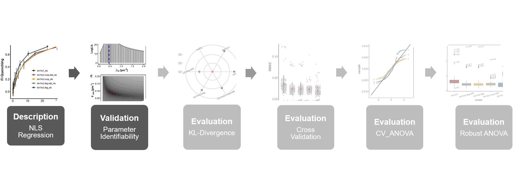
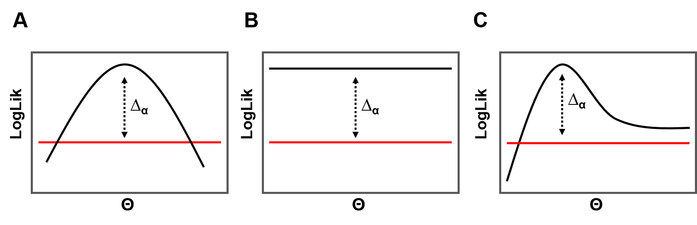

```{css, echo = FALSE}
h1, #TOC>ul>li {
  font-weight: bold;
}

```

```{r setup, include=FALSE}
knitr::opts_chunk$set(echo = TRUE)
knitr::opts_chunk$set(fig.align = 'center')
```

```{r packages, include=TRUE, message=FALSE, warning=FALSE}
library(bookdown)
library(minpack.lm)
library(readxl)
library(dplyr)
library(purrr)
library(tidyr)
library(ggplot2)
library(ggpubr)
library(tibble)
library(ggsci)
library(latex2exp)
library(AICcmodavg)
library(vtreat)
library(kableExtra)
library(broom)
# automatically create a bib database for R packages
knitr::write_bib(c(
  .packages(), 'bookdown', 'knitr', 'rmarkdown'
), 'packages.bib')
```

```{r roadmap, include=TRUE, echo=FALSE, out.width="100%", fig.cap="**Statistical analysis roadmap.** "}

```

# Objective

****
**The purpose of identifiability analysis is to detect whether the point estimates obtained via nls fitting are uniquely determined given a specific model type and measurement set up. In this work parameter identifiability was investigated via maximum likelihood profiling in a qualitative way. During this process a model parameter under study is fixed at specified values around its best fit nls point estimate and all other model parameter are re-optimized via maximum likelihood estimation based on the underlying likelihood function of that particular model. In this context a paramter is identifiable when its maximum likelihood profile has a unique maximum and a finite confidence interval. Besides being identifiable a parameter might also be found to be either practically or structurally non-identifiable as schematically represented in figure \@ref(fig:pictureProfLik). This approach allows to relate such non-identifiability scenarios to the quality of the measurement set up and model parameterizations.** 

****

# Methods
## Maximum Likelihood Profiling{#lik}

* Model-specific parameter point estimates obtained by nls regression analysis ([Rpubs1.1](https://rpubs.com/DeTwes/NLS-Regression)) tested for parameter identifiability based on maximum likelihood profiling 
* In case of statistically independent and additive Gaussian noise as well as constant variance ($\epsilon$ ~ $N(0,\sigma^2)$), the logarithmic form of the likelihood function $\mathcal{L}(*)$ for a given binding model $g(x_i, \theta)$ with parameter **$\theta$** is given by equaion \@ref(eq:loglik):

\begin{equation}
log(\mathcal{L}(\theta| x,g)) = -\frac{n}{2}log(2\pi\sigma^2)-\frac{1}{2\sigma^2}\sum\limits_{i=1}^n (y_i-g(x_i,\theta))^2
(\#eq:loglik)
\end{equation}


* When equation \@ref(eq:loglik) is evaluated for a given binding model when its parameters are set to the best fit point estimates determined by the nls regression analysis, $\hat{\theta}_{nls}$, then the maximum of the log-likelihood function ($log(\mathcal{L}(\hat{\theta}_{nls}))$) is obtained since maximizing the likelihood function is equivalent to minimizing the residual sum of squares in a nls sense 
* In classical hypothesis testing ($log(\mathcal{L}(\hat{\theta}_{nls}))$) represents the augmented or full model. When a parameter $\theta_i$ is iteratively changed around its best fit nls point estimate ($\hat{\theta}_{i,nls}$) according to values specified by a vector $\overrightarrow{p}^t = (\theta_{i,1}, ... , \hat{\theta}_{i,nls}, ..., \theta_{i,n})$,  and all other parameters $\theta_{i\neq j}$ are re-optimized based on equation \@ref(eq:loglik), then the profile log-likelihood function $\mathcal{P}\mathcal{L}_i(\overrightarrow{p})$ for parameter $\theta_i$ can be obtained according to equation \@ref(eq:profilelik):

\begin{equation}
\mathcal{P}\mathcal{L}_i(\overrightarrow{p})=\operatorname*{arg\,max}_{\left\{\theta| \theta_i=p_i\right\}} \,log(\mathcal{L}(\theta| x,g))
(\#eq:profilelik)
\end{equation}

```{r loglikFuns, warning=FALSE}
ll.1to2.deg.add <- function(param, obs, g.curr, profile.par = NULL, ...){
  
  g0 <- g.curr
  if (is.null(profile.par)){
    Fpred <- bm1to2.deg.add(param["fhg"], param["k1"], g0)
  }  else if (all(profile.par == "fhg")){
    Fpred <- bm1to2.deg.add(..., param["k1"], g0)
  } else if (all(profile.par == "k1")){
    Fpred <- bm1to2.deg.add(param["fhg"], ..., g0)
  } else if (all(profile.par == c("fhg", "k1"))){
    Fpred <- bm1to2.deg.add(..., g0)
  }
  
  lnlik <- sum(dnorm(x = obs$que_fi, 
                     mean = Fpred, 
                     sd = param["sig"], 
                     log = TRUE))
  return(lnlik)
}

ll.1to2.coop.add <- function(param, obs, g.curr, profile.par = NULL, ...){
  g0 <- g.curr
  if (is.null(profile.par)){
    Fpred <- bm1to2.coop.add(param["fhg"], param["k1"], param["k2"], g0)
  } else if (all(profile.par == "fhg")){
    Fpred <- bm1to2.coop.add(..., param["k1"], param["k2"], g0)
  } else if (all(profile.par == "k1")){
    Fpred <- bm1to2.coop.add(param["fhg"], ..., param["k2"], g0)
  } else if (all(profile.par == "k2")){
    Fpred <- bm1to2.coop.add(param["fhg"], param["k1"], ..., g0)
  } else if (all(profile.par == c("fhg", "k1"))){
    Fpred <- bm1to2.coop.add(..., param["k2"], g0)
  } else if (all(profile.par == c("fhg", "k2"))){
    Fpred <- bm1to2.coop.add(..., param["k1"], g0)
  } else if (all(profile.par == c("k1", "k2"))){
    Fpred <- bm1to2.coop.add(param["fhg"], ..., g0)
  }
  
  lnlik <- sum(dnorm(x = obs$que_fi, 
                     mean = Fpred, 
                     sd = param["sig"], 
                     log = TRUE))
  return(lnlik)
}

ll.1to2.coop <- function(param, obs, g.curr, profile.par = NULL, ...){
  g0 <- g.curr
  if (is.null(profile.par)){
    Fpred <- bm1to2.coop(param["fhg"], param["fhg2"], param["k1"], 
                         param["k2"], g0)
  } else if (all(profile.par == "fhg")){
    Fpred <- bm1to2.coop(..., param["fhg2"], param["k1"], param["k2"], g0)
  } else if (all(profile.par == "fhg2")){
    Fpred <- bm1to2.coop(param["fhg"], ..., param["k1"], param["k2"], g0)
  } else if (all(profile.par == "k1")){
    Fpred <- bm1to2.coop(param["fhg"], param["fhg2"], ..., param["k2"], g0)
  } else if (all(profile.par == "k2")){
    Fpred <- bm1to2.coop(param["fhg"], param["fhg2"], param["k1"], ..., g0)
  } else if (all(profile.par == c("fhg", "fhg2"))){
    Fpred <- bm1to2.coop(..., param["k1"], param["k2"], g0)
  } else if (all(profile.par == c("fhg", "k1"))){
    Fpred <- bm1to2.coop(..., param["fhg2"], param["k2"], g0)
  } else if (all(profile.par == c("fhg", "k2"))){
    Fpred <- bm1to2.coop(..., param["fhg2"], param["k1"], g0)
  } else if (all(profile.par == c("fhg2", "k1"))){
    Fpred <- bm1to2.coop(param["fhg"], ..., param["k2"], g0)
  } else if (all(profile.par == c("fhg2", "k2"))){
    Fpred <- bm1to2.coop(param["fhg"], ..., param["k1"], g0)
  } else if (all(profile.par == c("k1", "k2"))){
    Fpred <- bm1to2.coop(param["fhg"], param["fhg2"], ..., g0)
  }
  
  lnlik <- sum(dnorm(x = obs$que_fi, 
                     mean = Fpred, 
                     sd = param["sig"], 
                     log = TRUE))
  return(lnlik)
}
```

* $\mathcal{P}\mathcal{L}_i(\overrightarrow{p})$ represents a nested version of the augmented model where the parameter which is profiled out is treated as a constant 
* The deviances between the augmented model and each of the nested models, $2log(\mathcal{L}(\hat{\theta}_{nls}))$ - $2\mathcal{P}\mathcal{L}_i(\overrightarrow{p})$, are focused 1 degrees of freedom ($df$) comparisons that all belong to the same $\chi^2$-distribution with 1 $df$ (null distribution)
* Based on this distribution the corresponding 95% profile log-likelihood confidence interval ($CI$) for parameter $\theta_i$ is given by equation \@ref(eq:cisimple):

\begin{equation}
CI_{\mathcal{P}\mathcal{L}(\theta_i)=}\left\{ p_i| \mathcal{P}\mathcal{L}_i(p_i) \geq log(\mathcal{L}(\hat{\theta}_{nls}))-\frac{\chi^2_{0.95,1}}{2} \right\}
(\#eq:cisimple)
\end{equation}

* The $CI$ contains all parameter vlaues of $\theta_i$ for which the corresponding profile log-likelihood function exceeds a threshold ($\Delta_\alpha$ in figure \@ref(fig:pictureProfLik)) determined by the critical value according to a significance level of .05 ($\chi^2_{.95,1}$)
* Construction of the $CI$ can be thought of as a reverse likelihood ratio test
* If a parameter is identifiable, the corresponding log-likelihood profile (figure \@ref(fig:pictureProfLik)A) exhibits a unique maximum and a finite $CI$ (red line)
* A parameter can be unidentifiable in one of two ways: 
  + A structurally unidentifiable parameter (B) has a flat log-likelihood profile with an infinite $CI$  
  + A practically unidentifiable parameter shows a unique maximum of the log-likelihood profile but a $CI$ that is only bound on one site (C)
* Concept can be extended for two parameters so that joint profile log-likelihood contours and confidence regions can be obtained as described by equations \@ref(eq:profiletwo) and \@ref(eq:citwo):

\begin{equation}
\mathcal{P}\mathcal{L}_{ij}(\overrightarrow{p},\overrightarrow{q})=\operatorname*{arg\,max}_{\left\{\theta| \theta_i=p_i,\theta_j=q_i \right\}} log(\mathcal{L}(\theta| x,g)
(\#eq:profiletwo)
\end{equation}

\begin{equation}
CI_{\mathcal{P}\mathcal{L}(\theta_i,\theta_j)=}\left\{ p_i,q_i| \mathcal{P}\mathcal{L}_{ij}(p_i,q_i) \geq log(\mathcal{L}(\hat{\theta}_{nls}))-\frac{\chi^2_{0.95,2}}{2} \right\}
(\#eq:citwo)
\end{equation}

* For optimization the Nelder-Meadt algorithm was used implemented in R

```{r pictureProfLik, include=TRUE, echo=FALSE, out.width="90%", fig.cap="**Possible outcomes of a parameter identifiability analysis** The log-likelihood profile for a given parameter and binding model is obtained by treating this parameter as a constant set to a specified value while re-optimizing the remaining parameter of that model as part of its likelihood function. The corresponding 95% profile log-likelihood confidence interval (red line) is derived using a threshold ($\\Delta_\\alpha$) in the likelihood according to a critical value of a $\\chi^2_{.95,1}$-distribution with 1 $df$. The shape of the profile with respect to the $CI$ is used to judge parameter identifiability. **A:** The log-likelihood profile of an identifialbe parameter contains a unique maximum and a finite $CI$. **B:** A structurally unidentifiable parameter has a flat log-likelihood profile and an infinite $CI$. **C:** A practically unidentifiable parameter shows a unique maximum of the log-likelihood profile and a $CI$ that is only bound on either lower or uppper values of the parameter under study."}

```

# Major Results

```{r genericFuns}
####..........generic functions and objects....................####

prof.seq <- function(lower, upper, len = 100){
  seq(lower, upper, length = len)
}
####Plotting####
mytheme_axes_box =
  theme_bw()+
  theme(axis.ticks.length=unit(.07, "cm"))+
  theme(axis.ticks = element_line(colour = "black", size = 1))+
  theme(axis.text.y = element_text(color="black",size = 10))+
  theme(axis.text.x = element_text(color="black",size = 10))+
  theme(axis.title.y = element_text(size = 12,face = "bold"))+
  theme(axis.title.x = element_text(size = 12,face = "bold"))+
  theme(panel.grid.minor=element_blank(),
        panel.grid.major=element_blank(),
        panel.border = element_rect(size = 1, color = "black"))

single.prof.plot <- function(model.list, mle.obj, theta){
  prof.tbl <- tibble(loglik = unlist(model.list$lik.profile[theta]),
                     theta = unlist(model.list$profile.vals[theta])
  )
  ci95 <- mle.obj$value - (qchisq(0.95,1)/2)
  prof.tbl <- prof.tbl %>% 
    mutate(ci_bound = loglik >= ci95)
  
  ggplot(prof.tbl, aes(y = loglik, x = theta, color = ci_bound))+
    geom_segment(aes(x = theta, 
                     y = 0, 
                     xend = theta, 
                     yend = loglik))+
    geom_point()+
    scale_colour_manual(values = c("grey60", "black"))+
    theme(legend.position = "none")+
    geom_vline(xintercept = mle.obj$par[theta],
               color = "#0033FF", size = 1.1, lty = 2)+
    geom_hline(yintercept = ci95,
               color = "#CC0000", size = 1.1)+
    xlab(names(
      model.list$profile.vals[which(names(model.list$profile.vals) == theta)])
    )
}

contour.plot <- function(model.list, mle.obj, theta){
  conf95 <- mle.obj$value - qchisq(0.95,2)/2
  grid.vals <- data.frame(expand.grid(
    unlist(model.list$profile.vals[theta[1]]), 
    unlist(model.list$profile.vals[theta[2]])))
  prof.vals <- data.frame(model.list$lik.profile[paste(theta[1], 
                                                       theta[2], 
                                                       sep = ".")])
  names(prof.vals) <- "loglik"
  prof.contour <- cbind(grid.vals, prof.vals)
  
  ggplot(prof.contour, aes(y = Var1, 
                           x = Var2, 
                           z = loglik))+
    theme_minimal()+
    geom_tile(aes(fill = loglik))+
    stat_contour(color = "black")+
    geom_point(aes(y = mle.obj$par[theta[1]],
                   x = mle.obj$par[theta[2]]),
               color = "#0033FF")+
    scale_fill_continuous(low="grey70",high="grey15")+
    stat_contour(breaks=c(conf95), color = "#CC0000")+
    ylab(theta[1])+
    xlab(theta[2])
}

####Model Lists initializations and expansions####
profile.vals <- list()
lik.profile <- list()

source("Functions/binding_models.R", local = knitr::knit_global())
bm1to1_nls <- readRDS("Output/model1.rds")
bm1to2.deg.add_nls <- readRDS("Output/model2.rds")
bm1to2.deg_nls <- readRDS("Output/model3.rds")
bm1to2.coop.add_nls <- readRDS("Output/model4.rds")
bm1to2.coop_nls <- readRDS("Output/model5.rds")
fi <- readRDS("Output/fi.rds")


bm1to2.deg.add_nls$nls.coef <- c(coef(bm1to2.deg.add_nls$bm1to2.deg.add),
                                 sig = sigma(bm1to2.deg.add_nls$bm1to2.deg.add))
bm1to2.deg_nls$nls.coef <- c(coef(bm1to2.deg_nls$bm1to2.deg),
                             sig = sigma(bm1to2.deg_nls$bm1to2.deg))
bm1to2.coop.add_nls$nls.coef <- c(coef(bm1to2.coop.add_nls$bm1to2.coop.add),
                                  sig = sigma(bm1to2.coop.add_nls$bm1to2.coop.add))
bm1to2.coop.add_nls$nls.coef <- c(coef(bm1to2.coop.add_nls$bm1to2.coop.add),
                                  sig = sigma(bm1to2.coop.add_nls$bm1to2.coop.add))

bm1to2.coop_nls$nls.coef <- c(coef(bm1to2.coop_nls$bm1to2.coop),
                              sig = sigma(bm1to2.coop_nls$bm1to2.coop))
```

* Logarithmic likelihood functions (log-likelihood) were built for each model on the basis of Gaussian probability density function with constant variance as described by equation \@ref(eq:loglik)
* This basic function was used for maximum likelihood profiling as specified by equation \@ref(eq:profilelik)
* log-likelihood and profile log-likelihood functions were implemented in R via: 
  + `ll.1to2.deg.add` function in case of degenerative models 
  + `ll.1to2.coop` function in case of cooperative models
* Results are depicted in figure \@ref(fig:profilingPlots), respectively, for selected parameter of the cooperative `bm1to2.coop` and `bm1to2.coop.add` models and for the degenerative `bm1to2.deg.add` model
* Profiles show maximized log-likelihood values as points for each specified value of the parameter to be profiled, evaluated around their best fit parameter nls point estimates (blue lines)
* Red lines represent the threshold of a 0.95 percentile confidence interval ($CI_{0.95}$) determined based on $\chi^2$-distribution with one $df$, depicted in eq. \@ref(eq:cisimple)
* Curve progression of the log-likelihood profile with respect to the $CI_{0.95}$ was used as a qualitative criterion to judge parameter identifiability
* **`bm1to2.coop` binding model:**
  + Proportionality factor $F_{\Delta HG}$ is an identifiable parameter (\@ref(fig:profilingPlots)B), 
  + Its profile exhibits a smooth parabolic curve crossing the lower and upper border of the $CI_{0.95}$ and reaching an expected unique maximum at the point when $F_{\Delta HG}$ is fixed at its best fit nls point estimate
  + Macroscopic binding constant $K_1$ is a structurally non-identifiable parameter  (\@ref(fig:profilingPlots)D) 
  + Maximum likelihood profile is flat over a wide range of the scanned parameter space, does not possess a finite $CI_{0.95}$
  + For every specified parameter value of $K_1$ the same maximum of the re-optimized log-likelihood function is found
  + Joint maximum likelihood profile of $K_1$ and $F_{\Delta HG}$ (\@ref(fig:profilingPlots)F) computed based on eq. \@ref(eq:profiletwo) shows parallel likelihood contours, the confidence region (eq. \@ref(eq:citwo)) is reduced to a line that could be infinitely extended
* **`bm1to2.coop.add` binding model:**
  + Macroscopic binding constant $K_2$ is practically non-identifiable (\@ref(fig:profilingPlots)G)
  + the $CI_{0.95}$ around its best fit nls point estimate does not reveal a lower bound in the allowed range above zero
* When the $df$ are further increased all parameter become identifiable
* **`bm1to2.deg.add` binding model:**
  + $F_{\Delta HG}$ and $\beta_{12}$ (\@ref(fig:profilingPlots)A,C) both are identifiable
  + Log-likelihood profiles peak at the respective parameter values of the best fit nls point estimates and have finite confidence intervals
  + There exists a closed confidence region in the joint profile log-likelihood space of these parameters (\@ref(fig:profilingPlots)E, red circle)
  
```{r profiling, warning=FALSE, cache=TRUE}
####Maximum Likelihood Estimation####
mle.deg.add <- optim(bm1to2.deg.add_nls$nls.coef,
                     ll.1to2.deg.add,
                     obs = fi,
                     g.curr = bm1to2.deg.add_nls$g,
                     control = list(fnscale=-1)
)

mle.coop.add <- optim(bm1to2.coop.add_nls$nls.coef,
                      ll.1to2.coop.add,
                      obs = fi,
                      g.curr = bm1to2.coop.add_nls$g,
                      control = list(fnscale=-1))

mle.coop <- optim(bm1to2.coop_nls$nls.coef,
                  ll.1to2.coop,
                  obs = fi,
                  g.curr = bm1to2.coop_nls$g,
                  control = list(fnscale=-1))

####......Single param profiles bm1to2.deg.add.......####
####k1#####
bm1to2.deg.add_nls$profile.vals$k1 <- prof.seq(0.05, 2)

bm1to2.deg.add_nls$lik.profile$k1 <- sapply(
  bm1to2.deg.add_nls$profile.vals$k1, function(k1) 
    optim(bm1to2.deg.add_nls$nls.coef,
          ll.1to2.deg.add,
          obs = fi,
          g.curr = bm1to2.deg.add_nls$g,
          profile.par = "k1",
          k1 = k1,
          method = "L-BFGS-B",
          lower = c(0.001,0.001),
          control=list(fnscale = -1))$val)

####fhg#####################################################

bm1to2.deg.add_nls$profile.vals$fhg <- prof.seq(0.01, 0.2)

bm1to2.deg.add_nls$lik.profile$fhg <- sapply(
  bm1to2.deg.add_nls$profile.vals$fhg, function(fhg) 
    optim(bm1to2.deg.add_nls$nls.coef,
          ll.1to2.deg.add,
          obs = fi,
          g.curr = bm1to2.deg.add_nls$g,
          profile.par = "fhg",
          fhg = fhg,
          method = "L-BFGS-B",
          lower = c(0.001,0.001),
          control=list(fnscale = -1))$val)

####............Single param profiles bm1to2.coop.add..........####
####k2####
bm1to2.coop.add_nls$profile.vals$k2 <- prof.seq(0.001, 0.12)

bm1to2.coop.add_nls$lik.profile$k2 <- sapply(
  bm1to2.coop.add_nls$profile.vals$k2, function(k2) 
    optim(bm1to2.coop.add_nls$nls.coef,
          ll.1to2.coop.add,
          obs = fi,
          g.curr = bm1to2.coop.add_nls$g,
          profile.par = "k2",
          k2 = k2,
          control=list(fnscale = -1))$val)
####............Single param profiles bm1to2.coop.............####
####fhg####
bm1to2.coop_nls$profile.vals$fhg <- prof.seq(0.001, 0.017)
bm1to2.coop_nls$lik.profile$fhg <- sapply(
  bm1to2.coop_nls$profile.vals$fhg, function(fhg) 
    optim(bm1to2.coop_nls$nls.coef,
          ll.1to2.coop,
          obs = fi,
          g.curr = bm1to2.coop_nls$g,
          profile.par = "fhg",
          fhg = fhg,
          method = "L-BFGS-B",
          lower = c(0.001,0.001),
          control=list(fnscale = -1))$val)

####K1
bm1to2.coop_nls$profile.vals$k1 <- prof.seq(1000000, 5000000)
bm1to2.coop_nls$lik.profile$k1 <- sapply(
  bm1to2.coop_nls$profile.vals$k1, function(k1) 
    optim(bm1to2.coop_nls$nls.coef,
          ll.1to2.coop,
          obs = fi,
          g.curr = bm1to2.coop_nls$g,
          profile.par = "k1",
          k1 = k1,
          method = "L-BFGS-B",
          lower = c(0.001,0.001),
          control=list(fnscale = -1))$val)

####.............profile contour bm1to2.deg.add...............#####
####fhg.k1####
grid.deg.add.fhg.k1 <- data.frame(
  t(expand.grid(unlist(
    bm1to2.deg.add_nls$profile.vals$fhg), 
    unlist(bm1to2.deg.add_nls$profile.vals$k1))))

bm1to2.deg.add_nls$lik.profile$fhg.k1 <- sapply(
  grid.deg.add.fhg.k1, function(v) 
    optim(bm1to2.deg.add_nls$nls.coef,
          ll.1to2.deg.add,
          obs = fi,
          g.curr = bm1to2.deg.add_nls$g,
          profile.par = c("fhg","k1"),
          fhg = v[1],
          k1 = v[2],
          method = "L-BFGS-B",
          lower = c(0.001,0.001),
          control=list(fnscale = -1))$val)

####.............profile contour bm1to2.coop...............#####
####fhg.k1####

grid.coop.fhg.k1 <- data.frame(
  t(expand.grid(unlist(
    bm1to2.coop_nls$profile.vals$fhg), 
    unlist(bm1to2.coop_nls$profile.vals$k1))))

bm1to2.coop_nls$lik.profile$fhg.k1 <- sapply(
  grid.coop.fhg.k1, function(v) 
    optim(bm1to2.coop_nls$nls.coef,
          ll.1to2.coop,
          obs = fi,
          g.curr = bm1to2.coop_nls$g,
          profile.par = c("fhg","k1"),
          fhg = v[1],
          k1 = v[2],
          method = "L-BFGS-B",
          lower = c(0.001,0.001),
          control=list(fnscale = -1))$val)

```

```{r profilingPlots, fig.height=10,cache=TRUE, fig.cap="**Maximum likelihood profiling of model parameter**. To assess the extent of confidence in the model-specific parameter, a parameter identifiability analysis was performed based on maximum likelihood profiling. During the profiling process a parameter under study is fixed to specified values (abscissa) around its best fit nls point estimate (dashed line) while the remaining parameter of the log-likelihood function were re-optimized (ordinate). The shape of the profile around its maximum was used to qualitatively judge parameter identifiability. **B, D, F:** Maximum likelihood profiles of $F_{\\Delta HG}$ and $K_1$ from the bm1to2.coop model. $F_{\\Delta HG}$ (B) is an identifiable parameter with a unique maximum of the profile at its best fit nls estimate (3.62 $\\times$ 10<sup>-3</sup> μM<sup>-1</sup>) and a closed $CI_{0.95}$ (red line). $K_1$ (D) is a structurally non-identifiable parameter yielding a profile lacking a unique maximum and having an infinite $CI_{0.95}$. The joint likelihood profile (F) of both parameters exhibits parallel likelihood contours. Shades from black to white correspond to high and low values of the likelihood function, respectively. Likelihood contours are shown as black lines and best fit parameter values are indicated by a blue dot. **A, C, E:** Maximum likelihood profiles of $F_{\\Delta HG}$ and $\\beta_{12}$ from the bm1to2.deg.add model. Both parameter are identifiable resulting in a closed $CI_{0.95}$ contour in the two-dimensional profile likelihood landscape. **G** Maximum likelihood profile of $K_2$ from the bm1to2.coop.add model. $K_2$ is a practically non-identifiable parameter. Its profile exhibits a unique maximum but the $CI_{0.95}$ only has an upper bound."}
####.............Profile Plot bm1to2.deg.add...............####
####K1
profile_deg1 <- single.prof.plot(bm1to2.deg.add_nls, mle.deg.add, "k1")+
  mytheme_axes_box+
  ylab(TeX("$LogLik$",
           bold = TRUE))+
  xlab(TeX("$\\beta_{12}$ $\\[ µm^{-2} \\]$",
           bold = TRUE))+
  theme(legend.position = "none")

####fhg
profile_deg2 <- single.prof.plot(bm1to2.deg.add_nls, mle.deg.add, "fhg")+
  mytheme_axes_box+
  xlab(TeX("$F_{\\Delta HG}$ $\\[ µm^{-1} \\]$",
           bold = TRUE))+
  ylab(TeX("LogLik",
           bold = TRUE))+
  theme(legend.position = "none")

####.............Profile Plot bm1to2.coop.add............####
####k2
profile_coop.add <- single.prof.plot(bm1to2.coop.add_nls, mle.coop.add, "k2")+
  mytheme_axes_box+
  xlab(TeX("$K_2$ $\\[ µm^{-1} \\]$",
           bold = TRUE))+
  ylab(TeX("LogLik",
           bold = TRUE))+
  theme(legend.position = "none")

####.............Profile Plot bm1to2.coop...............####
####fhg
profile_coop1 <- single.prof.plot(bm1to2.coop_nls, mle.coop, "fhg")+
  mytheme_axes_box+
  xlab(TeX("$F_{\\Delta HG}$ $\\[ µm^{-1} \\]$",
           bold = TRUE))+
  ylab(TeX("LogLik",
           bold = TRUE))+
  theme(legend.position = "none")

####K1
profile_coop2 <- single.prof.plot(bm1to2.coop_nls, mle.coop, "k1")+
  mytheme_axes_box+
  xlab(TeX("$K_1$ $\\[ µm^{-1} \\]$",
           bold = TRUE))+
  ylab(TeX("LogLik",
           bold = TRUE))+
  theme(axis.text.x = element_text(angle = 25))+
  theme(legend.position = "none")

####.............Profile Contour Plots bm1to2.deg.add...............####
####fhg.k1
profile_deg3 <- contour.plot(bm1to2.deg.add_nls, 
                             mle.deg.add, 
                             theta = c("fhg", "k1"))+
  ylab(TeX("$F_{\\Delta HG}$ $\\[ µm^{-1} \\]$",
           bold = TRUE))+
  xlab(TeX("$\\beta_{12}$ $\\[ µm^{-2} \\]$",
           bold = TRUE))+
  mytheme_axes_box+
  theme(legend.position = "none")

####.............Profile Contour Plots bm1to2.coop......................####
####fhg.k1
profile_coop3 <- contour.plot(bm1to2.coop_nls, 
                              mle.coop, 
                              theta = c("fhg", "k1"))+
  mytheme_axes_box+
  ylab(TeX("$F_{\\Delta HG}$ $\\[ µm^{-1} \\]$",
           bold = TRUE))+
  xlab(TeX("$K_1$ $\\[ µm^{-1} \\]$",
           bold = TRUE))+
  theme(axis.text.x = element_text(angle = 25))+
  theme(legend.position = "none")

ggarrange(profile_deg2, profile_coop1, 
          profile_deg1, profile_coop2, 
          profile_deg3, profile_coop3,
          profile_coop.add,
          labels = c("A", "B", "C", "D", "E", "F", "G"),
          ncol = 2, nrow = 4)
```

# Conclusions

The nls regression analysis ([Rpubs1.1](https://rpubs.com/DeTwes/NLS-Regression)) has already revealed that the `bm1to2.coop` model yields unjustifiable parameter estimates. Going one step further, maximum likelihood profiling uncovered that the preliminary set up of the fluorescence spectroscopic titration experiment with an emphasis on the number of independent measurements and the number of data points causes parameter identifiability problems in the binding models generally describing cooperative binding of tRNA$\mathrm{^{Phe}_{Bs}}$ substrates to ThiI<sub>Tm</sub>.

Structural non-identifiability as seen in the global `bm1to2.coop` model is linked to over-parameterization. Currently the titration data set does not provide enough information in order to separately and uniquely estimate the $K_1$ parameter. This lack of identifiability can be solved in one of two ways. Firstly, the domain of the binding model can and should be further explored. The concentration range of the tRNA can be shifted towards higher concentrations where the tryptophan fluorescence signal is more stable. This will ultimately increase the signal to noise ratio while preserving the necessary amount of information in the data. The upper limit will be constrained by the absolute concentration of the tRNA that can be achieved after the purification process. Additionally, the information content of the data set could be further increased by narrowing the dilution steps of the reactions so that more data points are included. Secondly, the `bm1to2.coop` model can be re-parameterized to increase the degrees of freedom. For this reason a subset of simpler two-site binding models all representing nested versions of the global `bm1to2.coop` model were included in the model set. Practical non-identifiability as observed for the $K_2$ parameter of the `bm1to2.coop.add` model is linked to the noise level of the data. Hence, this lack of identifiability can be solved by increasing the quality of the data set, i.e. by increasing the number of independently measured titration profiles. 