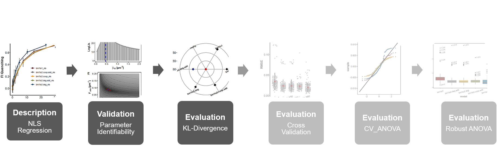

```{css, echo = FALSE}
h1, #TOC>ul>li {
  font-weight: bold;
}

```

```{r setup, include=FALSE}
knitr::opts_chunk$set(echo = TRUE)
knitr::opts_chunk$set(fig.align = 'center')
```

```{r packages, include=TRUE, message=FALSE, warning=FALSE}
library(bookdown)
library(minpack.lm)
library(readxl)
library(dplyr)
library(purrr)
library(tidyr)
library(ggplot2)
library(ggpubr)
library(tibble)
library(ggsci)
library(latex2exp)
library(AICcmodavg)
library(vtreat)
library(kableExtra)
library(broom)
# automatically create a bib database for R packages
knitr::write_bib(c(
  .packages(), 'bookdown', 'knitr', 'rmarkdown'
), 'packages.bib')
```

```{r roadmap, include=TRUE, echo=FALSE, out.width="100%", fig.cap="**Statistical analysis roadmap.** "}

```

# Objective

****
**An inevitable difficulty of the comparative analysis of variably parameterized binding models lies in the differences of the degrees of freedom that are linked to model complexity. As pointed out by @anderson04 it is always possible to achieve a higher goodness-of-fit by just using a more complex model with more free parameter. For this reason, emphasis was put on finding an appropriate criterion that takes into account goodness-of-fit as quantified by the $RMSE$ of the residuals but which is capable of neutralizing complexity differences between binding models under investigation. In information theory, the information lost when a model is used to approximate the true data generating process is described by the Kullback-Leibler (KL) distance. Hence, the KL divergence between a model and the data generating process can be used as a measure of performance for that particular model. The truly information theoretic KL divergence can be approximated by the $AIC$ which can be used in the context of nls regression analysis. It thereby takes into account the goodness of fit as determined by the $RMSE$ of the residuals as well as model complexity in terms of the number of parameter. Calculated $AIC$ scores for the binding models were used as a figure of merit in order to evaluate model performance in describing the ThiI<sub>Tm</sub>•tRNA$\mathrm{^{Phe}_{Bs}}$ binding profile.  In general, this approach can be thought of as a restricted regression. The idea is to evaluate the set of binding models by computing $AIC_c$ scores and align the members on an ordinal scale with respect to the best describing top-ranked model based on $AIC_c$ differences ($\Delta_i$).** 

****

# Methods
## Model evaluation based on the Akaike Information Criterion{#akaike}

* Performance of each model function in describing the ThiI<sub>Tm</sub>•tRNA$\mathrm{^{Phe}_{Bs}}$ titration profile was evaluated based on the Akaike Information Criterion ($AIC$)
* In this work the $AIC$ corrected for small sample sizes ($AIC_c$) was used
* Binding models were ranked based on the $AIC_c$ according to the following equation:

\begin{equation}
AIC_c = n\,log\left(\frac{\sum\limits_{i=1}^n \hat{\epsilon}^2_i}{n}\right)+2k+\frac{2k(k+1)}{n-k-1}
(\#eq:aicc)
\end{equation}

* Where $n$ = number of data points, $k$ = number of parameter and $\hat{\epsilon}^2_i$ = the estimated residuals obtained from the nls regression analysis
* Binding models were further ranked by $AIC_c$ differences ($\Delta$) specified in equation \@ref(eq:aiccdelta):

\begin{equation}
\Delta_i=AIC_{c,i}-AIC_{c,min}
(\#eq:aiccdelta)
\end{equation}

* Where $AIC_{c,min}$ is the $AIC_c$ of the top-ranked binding model that received the minimum $AIC_c$ score according to equation \@ref(eq:aicc) 
* Level of support for each binding model can be estimated using $\Delta_i$ values based on plausibility key as described by Anderson and Burnham (2004) and which is depicted in figure \@ref(fig:deltaAIC):
  + $\Delta_i$ values ranging between 0-2 translate to binding models having substantial support 
  + $\Delta_i$ values between 4-7 refer to binding models with considerably less support
  + Binding models receiving $\Delta_i$ values > 10 have essentially no support
* Based on $AIC_c$ differences Akaike weights (weights of evidence) for each binding model ($\Delta_i$) with respect to the whole model set ($\Delta_r$) were calculated based on equation \@ref(eq:weights):

\begin{equation}
\omega_i=\frac{exp(-\frac{1}{2}\Delta_i)}{\sum\limits_{r=1}^R exp(-\frac{1}{2}\Delta_r)}
(\#eq:weights)
\end{equation}

* Based on individual Akaike weights evidence ratios between two binding models were calculated according to equation \@ref(eq:ratio):

\begin{equation}
\frac{\omega_i}{\omega_j}
(\#eq:ratio)
\end{equation}

```{r deltaAIC, include=TRUE, echo=FALSE, out.width="60%", fig.cap="**Level of empirical support of binding model $i$.** Shown is a plausibility key expressed in terms of $AIC_c$ differences ($\\Delta_i$) as described by Anderson and Burnham (2004) based on empirical results. $0 \\leq \\Delta_i \\leq 2$: Substantial support for binding model $i$. $4 \\leq \\Delta_i \\leq 7$: Considerable less support for binding model $i$. $\\Delta_i > 10$: Essentially no support for binding model $i$."}

```

# Major Results

* First, the $AIC_c$ scores for every binding model were calculated based on the respective residual sum of squares obtained from the nls fits (\@ref(spectroscopy)) according to equation \@ref(eq:aicc)
* Scores are shown in table \@ref(tab:divTable) and figure \@ref(fig:divPlot)A 
* Scores represent approximated KL divergences on a negative ordinal scale between the binding models and the true but unknown data-generating process ("reality", red square) 
* Unknown data-generating process can be treated as a constant across all models 
* The lower the $AIC_c$ score of a model (radial grid lines), the smaller the KL divergence and the better its performance in describing the data
* Calculated $AIC_c$ scores point towards the `bm1to2.deg.add` model (blue diamond) to be the KL best model in the set since it received the lowest $AIC_c$ score amounting to -52.4 
* Competing binding models were further ranked by calculation of $AIC_c$ differences ($\Delta_i$) for each binding model with respect to the top-ranked `bm1to2.deg.add` model (equation \@ref(eq:aiccdelta))
* In this way the unknown "reality" is canceled out and $\Delta_i$ values now reflect increments of KL divergences between the `bm1to2.deg.add` model ($\Delta_i$ = 0) and all other competing models (figure \@ref(fig:divPlot)B)
* Those $\Delta_i$ values were used as a basis to quantify the plausibility of each model as being the KL best model in the set instead of the actual top-ranked `bm1to2.deg.add` model
* This was achieved by normalization of the $\Delta_i$ values to be a set of Akaike weights $\omega_i$ (evidence weights) adding to 1 as described by equation \@ref(eq:weights)
* Additionally, evidence ratios $\frac{\omega_i}{\omega_j}$ (equation \@ref(eq:ratio)) between the `bm1to2.deg.add` model and the remaining models in the set were computed
* The top-ranked `bm1to2.deg.add` model received 70.8% of the total weight of evidence of being the actual KL best model considering all models in the set
* The `bm1to2.deg.add` model was the only one found to have substantial support of being the KL best model since no other model received a $\Delta_i$ value less than 2 (see plausibility key, \@ref(fig:deltaAIC))
* The `bm1to2.coop.add` model is ranked the second best in the set having an $AIC_c$ score of -49.0 corresponding to a $\Delta_i$ value of 3.35 which accounts for a weight of evidence of 13.3%
* The remaining models all having $\Delta_i$ values greater than 2 but less than 7 would be considered as having considerable less support of being the KL best model in the set ($4 \leq \Delta_i \leq 7$, see \@ref(fig:deltaAIC)) 
* Also considering evidence ratios, the `bm1to2.deg.add` model is 5.3 times more likely to be the KL best model instead of the `bm1to2.coop.add` model
* The model ranked lowest comprises the one-site binding model `bm1to1` which got the highest $AIC_c$ score (-46.2) and a weight of evidence of 3.19% of being the KL best model in the set
* It is 22.2 times more likely that the ThiI<sub>Tm</sub>•tRNA$\mathrm{^{Phe}_{Bs}}$
binding profile was generated by the `bm1to2.deg.add` model than by the `bm1to1` model.


```{r divergence}
####.......Loading.....#####
bm1to1_nls <- readRDS("Output/model1.rds")
bm1to2.deg.add_nls <- readRDS("Output/model2.rds")
bm1to2.deg_nls <- readRDS("Output/model3.rds")
bm1to2.coop.add_nls <- readRDS("Output/model4.rds")
bm1to2.coop_nls <- readRDS("Output/model5.rds")
fi <- readRDS("Output/fi.rds")
rmse <- readRDS("Output/rmse.rds")
####..........model performance analysis by aicc..............####
model.list <- list(bm1to1 = bm1to1_nls,
                   bm1to2.deg.add = bm1to2.deg.add_nls,
                   bm1to2.deg = bm1to2.deg_nls,
                   bm1to2.coop.add = bm1to2.coop.add_nls,
                   bm1to2.coop = bm1to2.coop_nls)

aicc_score <- model.list %>%
  map(`[[`, 1) %>% 
  map_dbl(~ AICc(.x)) 

k <- model.list %>% 
  map(`[[`, 1) %>% 
  map_dbl(~ length(coef(.x))) 


model.aicc <- tibble(model = names(model.list),
                     k = k +1,
                     RMSE = rmse,
                     aicc = aicc_score)

model.aicc <- model.aicc %>% 
  mutate(del_aicc = aicc - min(aicc),
         aicc_wt = (exp(-del_aicc/2)/sum(exp(-del_aicc/2)))*100) %>% 
  arrange(del_aicc) %>% 
  mutate(cum_wt = cumsum(aicc_wt))

model.aicc.best <- model.aicc[1,]

model.aicc.reality <- model.aicc %>% 
  select(model, aicc)
model.aicc.reality[6,1] <- c("reality")
model.aicc.reality[6,2] <- c(-60)

only.reality <- model.aicc.reality[6,]
only.best.model <- model.aicc.reality %>% 
  filter(model == "bm1to2.deg.add")
```

```{r divPlot, fig.height=4, fig.width=8, echo=FALSE,fig.cap="**Ranking of binding models according to their AIC<sub>c</sub> scores. A:** AIC<sub>c</sub> scores evaluating model performances in describing the ThiI<sub>Tm</sub>•$tRNA^{Phe}_{Bs}$ titration profile are highlighted as radial grid lines in the radar plot. They represent approximated KL distances on an ordinal scale with respect to the true data-generating process (\"reality\", red diamond). \"Reality\" represents the origin of the plot and is arbitrarily set to -60 for visualization purposes. Models were ranked based on the AIC<sub>c</sub> scores with the bm1to2.deg.add model (blue diamond) being the top-ranked model which got the smallest AIC<sub>c</sub> score (-52.4) and therefore best describes the binding curve. **B:** Binding models were further ranked based on AIC<sub>c</sub> differences ($\\Delta_i$) with respect to the top-ranked bm1to2.deg.add model ($\\Delta_i = 0$) so that \"reality\" treated as a constant across all models is canceled out. Calculated $\\Delta_i$ values point towards the bm1to2.coop.add model as being the most competitive model ($\\Delta_i = 3.3$) in the set with respect to the top-ranked bm1to2.deg.add model."}

delta.aicc.plot <- model.aicc %>% 
  ggplot(aes(y = del_aicc, x = model))+
  geom_point(size = 3.5, 
             shape = 23, fill = "black",
             color = "black")+
  geom_point(data = model.aicc.best,
             fill = "royalblue4",
             size = 3.5, 
             shape = 23,)+
  coord_polar()+
  theme_minimal()+
  theme(axis.ticks.length=unit(.07, "cm"))+
  theme(axis.ticks = element_line(colour = "black", size = 1))+
  theme(axis.text.y = element_text(color="black",size = 12))+
  theme(axis.text.x = element_text(color="black",size = 9,face = "bold"))+
  theme(axis.title.y = element_text(size = 14,face = "bold"))+
  theme(axis.title.x = element_blank())+
  theme(panel.grid.major = element_line(colour = "grey70",
                                        size = 0.8))+
  theme(axis.text.x = element_text(angle = 25))+
  ylab(TeX("$\\Delta_i$", bold = TRUE))


aicc.plot <- model.aicc.reality %>% 
  ggplot(aes(y = aicc, x = model))+
  geom_point(size = 3.5, 
             shape = 23, fill = "black",
             color = "black")+
  geom_point(data = only.reality,
             fill = "red3",
             size = 3.5, 
             shape = 23,)+
  geom_point(data = only.best.model,
             fill = "royalblue4",
             size = 3.5, 
             shape = 23,)+
  coord_polar()+
  theme_minimal()+
  theme(axis.ticks.length=unit(.07, "cm"))+
  theme(axis.ticks = element_line(colour = "black", size = 1))+
  theme(axis.text.y = element_text(color="black",size = 12))+
  theme(axis.text.x = element_text(color="black",size = 9,face = "bold"))+
  theme(axis.title.y = element_text(size = 14,face = "bold"))+
  theme(axis.title.x = element_blank())+
  theme(panel.grid.major = element_line(colour = "grey70",
                                        size = 0.8))+
  theme(axis.text.x = element_text(angle = 25),
        axis.text.x.bottom = element_text(hjust = -2))+
  ylab(TeX("$AIC_c$", bold = TRUE))

ggarrange(aicc.plot, delta.aicc.plot, 
          labels = c("A", "B"),
          ncol = 2, nrow = 1)

```

```{r divTable, echo=FALSE}

kable(model.aicc, caption = "**Results of the KL divergence analysis.** Performance of binding models in the nls regression of the ThiI<sub>Tm</sub>•tRNA$\\mathrm{^{Phe}_{Bs}}$ binding isotherm was evaluated based on $AIC_c$ scores according to which models are ranked in this table. $RMSE$ values are those from the nls regression analysis. $\\Delta_i$ = AIC<sub>c</sub> differences, $\\omega_i$ = evidence weights, CUSUM = cumulative sum of the evidence weights, k = number of parameter including an additional parameter for estimating the variance.",
      col.names = c("$Model$",
                    "$k$",
                    "$RMSE$",
                    "$AIC_c$",
                    "$\\Delta_i$",
                    "$\\omega_i$",
                    "$CUSUM$")) %>% 
  kable_classic() %>% 
  row_spec(0, background = "grey")
```


# Conclusions

Until that point analytic steps involving the evaluation of model performance were all conditional
on the data set based on which the nls regression itself was carried out. In order to evaluate
how generalizable those performances would be on new data, binding models were additionally subjected to cross-validation.

model selection based on the $AIC_c$ which efficiently and reliably trades off goodness-of-fit and model complexity.

In this way the relative strength of support for each of the binding models in the set could be assessed

