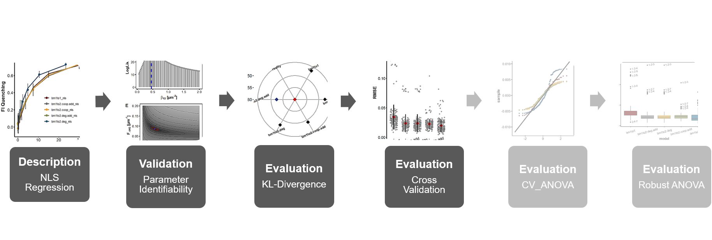

```{css, echo = FALSE}
h1, #TOC>ul>li {
  font-weight: bold;
}

```

```{r setup, include=FALSE}
knitr::opts_chunk$set(echo = TRUE)
knitr::opts_chunk$set(fig.align = 'center')
```

```{r packages, include=TRUE, message=FALSE, warning=FALSE}
library(bookdown)
library(minpack.lm)
library(readxl)
library(dplyr)
library(purrr)
library(tidyr)
library(ggplot2)
library(ggpubr)
library(tibble)
library(ggsci)
library(latex2exp)
library(AICcmodavg)
library(vtreat)
library(kableExtra)
library(broom)
# automatically create a bib database for R packages
knitr::write_bib(c(
  .packages(), 'bookdown', 'knitr', 'rmarkdown'
), 'packages.bib')
```

```{r roadmap, include=TRUE, echo=FALSE, out.width="100%", fig.cap="**Statistical analysis roadmap.** "}

```

# Objective

****
**When nls regression analysis as well as model evaluation such as KL divergence analysis are conducted just based on the same data set this could lead to results that are overoptimistic with respect to the assessment of model performance. When it comes to model evaluation, just as important as yielding an adequate best fit curve describing the titration data at hand is the capability of binding models to predict yet unseen titration data. For this reason binding models were also evaluated via cross-validation (CV) as a second criterion on the basis of which it is possible to simulate future data sets. In this way, dependencies of binding model performances on variations in the data set as would inevitably be caused by future titration experiments can be uncovered.** 

****

# Methods
## Complete k-Fold Cross-validation{#cv}

* Predictive power of model functions was assessed by complete $k$-fold cross-validation (CV)
* When $k$ = 4, the number of data points $n$ in the titration data set is partitioned according to the following relation 
$$ train \backslash test := \{x \in train | x \notin test \} $$
into two disjoint sub-sets called folds
* The test-fold contains $x$ = $n/k$ = 3 data points and the complementary train-fold contains the remaining data points
* nls regression was performed for each binding model on the train-fold and obtained parameter point estimates were then fixed and used to predict the data points in the test-fold 
* This was done for each possible combination $C_3(12) = \binom{n}{n/k} = \binom{12}{3} = 220$ of test-folds containing three data points
* For each test-fold combination, the predictive power was assessed by computation of a CV-score
* In this case the root mean squared error ($RMSE$) between the predicted ($\hat{y}_i$) and the observed ($y_i$) data points according to equation \@ref(eq:cross)
* Based on that the grand mean of the $RMSE$ ($\overline{RMSE}$) was determined taking into account all possible train-fold combinations
* Differences between those grand means with respect to the binding models were further investigated by analysis of variance (ANOVA) described in subsequent chapters

\begin{gather}
\overline{RMSE} = \frac{1}{C} \sum\limits_{i=1}^{C} RMSE_i  \quad 
\text{,where}\\
RMSE = \sqrt{\frac{SSE}{m}} \quad
\text{,and}\\
SSE = \sum\limits_{j=1}^m (\hat{y}_j-y_j)^2
\notag
(\#eq:cross)
\end{gather}


```{r crossvalFun}
k_fold_cross <- function(data,
                         model.list, 
                         model.fun = c("bm1to1", 
                                       "bm1to2.deg.add", 
                                       "bm1to2.deg", 
                                       "bm1to2.coop.add",
                                       "bm1to2.coop"),
                         nFolds){
  select.model <- match.arg(model.fun)
  nRow <- nrow(data)
  model.formula <- formula(model.list[[select.model]])
  model.coef <- as.list(coef(model.list[[select.model]]))
  model.list$cross_valid <- list()
  #############################################################
  # Set up list of all possible split combinations
  fold_comb <- combn(nRow, nRow / nFolds)
  sublist_app <- map(seq_len(ncol(fold_comb)), ~fold_comb[,.])
  
  split_list <- rep(list(list(train = vector("integer", length = 9L),
                              app = vector("integer", length = 3L))), 
                    times = ncol(fold_comb))
  
  split_list <- split_list %>% 
    map2(sublist_app, ~list(.x$app <- .y, 
                            .x$train <- seq(nRow)[- .y])) 
  
  for(i in seq_along(1:ncol(fold_comb))){
    names(split_list[[i]]) <- c("app", "train")
  }
  
  predict.vals <- vector(mode = "double", length = nRow / nFolds)
  
  if (select.model != "bm1to1"){
    data$trna <- model.list$g
    names(data) <- c("g.best", "que_fi")
  } 
  
  for(i in seq_along(1:ncol(fold_comb))){
    split <- split_list[[i]] 
    model <- nlsLM(model.formula, 
                   data = data[split$train,],
                   start = model.coef)
    predict.vals <- predict(model, newdata = data[split$app,])
    
    obs.vals <- data[split$app,"que_fi"]
    m <- length(predict.vals)
    fold_rmse <- sqrt(sum((obs.vals - predict.vals)^2) / m)
    model.list$cross_valid[[i]] <- fold_rmse
  }
  return(model.list)
}

```

# Major Results

* Complete 4-fold cross validation was performed for a total of 220 test-folds comprising every possible combination of three data points as described in \@ref(cv)
* The predictive power was iteratively assessed by computation of a CV-score representing the $RMSE$ between the predicted and the observed data as described in eq. \@ref(eq:cross)
* The distribution of these 220 individual CV-scores are shown for each binding model as grey dots in figure \@ref(fig:crossvalid)A
* The mean value (hereafter denoted as mean fold prediction error) is highlighted as red square and the standard deviation as a black line
* Mean fold prediction errors are also highlighted as blue bars in figure \@ref(fig:crossvalid)B and are compared to the $RMSE$s obtained from the respective nls regressions on the complete titration data set (red bars, hereafter denoted as nls prediction errors)

* The `bm1to1` model is the least predictive model in the set:
  + It received the highest absolute mean fold prediction error amounting to 3.44 $\times$ 10<sup>-2</sup>
  + It has the largest deviation from the nls prediction error ($\Delta RMSE$) amounting to 7.76 $\times$ 10<sup>-3</sup> 
* The global `bm1to2.coop` model is the best predictive model in the set:
  + It obtained a mean fold prediction error of 1.98 $\times$ 10<sup>-2</sup> that is best balanced with the nls prediction error ($\Delta RMSE$ = 1.95 $\times$ 10<sup>-3</sup>)

```{r crossvalid, warning=FALSE, fig.height=5, fig.cap="**Predictive power of binding models determined by cross-validation. A:** A complete 4-fold cross-validation was conducted in order to assess binding model generalizability on new data. The data set was iteratively split into test-folds containing three data points and into train-folds containing the complementary set of data points. For each binding model least squares regression was performed on the train-folds and obtained best fit parameter estimates were then used to predict the data points in the test-folds. This was iterated over each possible test-fold combination comprising three data points (220 times). For each combination the $RMSE$ was determined (grey dots) as well as the mean $RMSE$ (red square) and the standard deviation (black line). **B:** Mean $RMSE$ from A (blue) as well as the $RMSE$ obtained from the nls regression (red) are highlighted as bars. The bm1to1 model is the least predictive model while the bm1to2.coop model is the most predictive model in the set."}

source("Functions/binding_models.R", local = knitr::knit_global())
source("Functions/ggplot_theme.R", local = knitr::knit_global())
bm1to1_nls <- readRDS("Output/model1.rds")
bm1to2.deg.add_nls <- readRDS("Output/model2.rds")
bm1to2.deg_nls <- readRDS("Output/model3.rds")
bm1to2.coop.add_nls <- readRDS("Output/model4.rds")
bm1to2.coop_nls <- readRDS("Output/model5.rds")
fi <- readRDS("Output/fi.rds")

fi <- fi[,1:2]
bm1to1_nls <- k_fold_cross(data = fi,
                           model.list = bm1to1_nls,
                           model.fun = c("bm1to1"),
                           nFolds = 4)

bm1to2.deg_nls <- k_fold_cross(
  data = fi, 
  model.list = bm1to2.deg_nls, 
  model.fun = c("bm1to2.deg"),
  nFolds = 4)

bm1to2.deg.add_nls <- k_fold_cross(
  data = fi, 
  model.list = bm1to2.deg.add_nls, 
  model.fun = c("bm1to2.deg.add"),
  nFolds = 4)

bm1to2.coop.add_nls <- k_fold_cross(
  data = fi, 
  model.list = bm1to2.coop.add_nls, 
  model.fun = c("bm1to2.coop.add"),
  nFolds = 4)

bm1to2.coop_nls <- k_fold_cross(
  data = fi, 
  model.list = bm1to2.coop_nls, 
  model.fun = c("bm1to2.coop"),
  nFolds = 4)

cross_valid.ls <- list(bm1to1_nls,
                       bm1to2.deg.add_nls,
                       bm1to2.deg_nls,
                       bm1to2.coop.add_nls,
                       bm1to2.coop_nls)
names(cross_valid.ls) <- c("bm1to1", 
                           "bm1to2.deg.add", 
                           "bm1to2.deg", 
                           "bm1to2.coop.add",
                           "bm1to2.coop")

cross_error <- cross_valid.ls %>% 
  map("cross_valid") %>% 
  flatten()

model_sigma <- cross_valid.ls %>% 
  map(`[[`, 1) %>% 
  map_dbl(~ sigma(.x))

nRow <- 12
nFolds <- 4
fold_comb <- combn(nRow, nRow / nFolds)
sublist_app <- map(seq_len(ncol(fold_comb)), ~fold_comb[,.])
sublist_app_chr <- sublist_app %>% 
  map(`[`, c(1,2,3)) %>%
  map_chr(~paste0(.x, collapse = "-")) 

compCV.tbl <- tibble(model = factor(rep(names(cross_valid.ls), each = 220), 
                                   levels = names(cross_valid.ls)),
                    RMSE = unlist(cross_error),
                    fold = rep(c(1:220), times = 5),
                    fold_points = rep(sublist_app_chr, times = 5))

compCV_bar.tbl <- compCV.tbl %>% 
  group_by(model) %>% 
  summarise(cv_RMSE = mean(RMSE)) %>% 
  ungroup() %>% 
  mutate(nls_RMSE = model_sigma)

###############Plots#####################
posn.d <- position_dodge(0.9)
plotA <- ggplot(compCV.tbl, aes(y = RMSE, 
                                x = model))+
  geom_jitter(width = 0.3, color = "grey50", alpha = 0.6)+
  
  #stat_summary(fun.data = "mean_sdl", 
   #            fun.args = list(mult = 1), 
    #           geom = "errorbar", width = 0, 
     #          position = posn.d, size = 1.1)+
  stat_summary(fun = mean,
               geom = "pointrange",
               fun.max = function(x) mean(x) + sd(x),
               fun.min = function(x) mean(x) - sd(x),
               position = posn.d,
               shape = 23,
               size = 1)+
  stat_summary(fun.y = mean, geom = "point", 
               position = posn.d,
               fill = "red", size = 3.5, shape = 23)+
  mytheme_axes_grids+
  theme(axis.line.x = element_blank(),
        axis.text.x = element_text(angle = 15))

plotB <- compCV_bar.tbl %>% 
  pivot_longer(cols = - model, 
               names_to = "Prediction",
               values_to = "RMSE") %>% 
  mutate(Prediction = factor(Prediction,
                             levels = c("nls_RMSE", "cv_RMSE"))) %>%
  
  ggplot(aes(x = model, y = RMSE, fill = Prediction))+
  geom_bar(stat = "identity",position = "dodge")+
  scale_fill_brewer(palette = "Set1")+
  mytheme_axes_grids+
  theme(legend.position = c(0.8, 0.9),
        axis.line.x = element_blank(),
        axis.text.x = element_text(angle = 15))

ggarrange(plotA, plotB, 
          labels = c("A", "B"),
          ncol = 2, nrow = 1)

```

* The effect of the binding models on the respective CV-score distributions was further investigated by means of analysis of variance (ANOVA)
* Figure \@ref(fig:crossvalid)A already indicates that CV-scores are not normally distributed
* This is confirmed by figure \@ref(fig:cvOutlier)A where the CV-score distributions are summarized by boxplots 
* These plots highlight outlier with respect to every binding model
* Data points one and two of the titration data set are especially prevalent among the data point triplets of the test-folds based on which CV-scores were computed
* Each binding model is affected by outlier that is why the errors (residuals) of the ANOVA model are also not going to be normally distributed
* The generic ANOVA approach crucially depends on the assumption of normally distributed residuals
* For this reason, a robust ANOVA was additionally conducted by using CV-score distributions whose tails were trimmed by 20% (figure \@ref(fig:cvOutlier)B).

```{r cvOutlier, fig.height=4, fig.width=10, fig.cap="**CV-score distributions are affected by test- fold combinations. A:** The raw CV-score distributions shown in figure 3.4A are summarized by box plots across levels of binding model. Outlier are shown as dots and labeled by data point triplets comprising the respective test fold. The presence of outlier leads to a bimodal distribution of CV-scores violating the normality assumption. Data points one and two are especially prevalent amongst outlier test folds. Note that some data point triplets were omitted from the plot in order to prevent over-plotting. **B:** Shown are box plots of the CV-score distributions across levels of binding model after having trimmed 20% of the raw data from each side. The trimming has resolved the normality assumption about CV-scores. Generally, outlier are defined as the set of CV-scores according to the following formula: $X_{out} = \\{X|X < Q_1 - 1.5 \\times IQR \\lor X > Q_3 + 1.5 \\times IQR \\}$, where $Q_1$ and $Q_3$ are, respectively, the first and third quartiles and $IQR$ represents the interquartile range."}

is_outlier <- function(x) {
  return(x < quantile(x, 0.25) - 1.5 * IQR(x) | x > quantile(x, 0.75) + 1.5 * IQR(x))
}

compCV.out.tbl <- compCV.tbl %>% 
  group_by(model) %>% 
  mutate(is_outlier = ifelse(is_outlier(RMSE), RMSE, as.numeric(NA)))
compCV.out.tbl$fold_points[which(is.na(compCV.out.tbl$is_outlier))] <- as.numeric(NA)


pA <- ggplot(compCV.out.tbl, aes(y=RMSE, x=model, fill = model)) + 
  geom_boxplot() + 
  geom_text(aes(label=fold_points),
            na.rm=TRUE,
            hjust = -0.2,
            angle = 10,
            size = 3.2,
            check_overlap = TRUE)+
  mytheme_axes_box+
  scale_fill_uchicago()+
  theme(axis.text.x = element_text(angle = 15,
                                   vjust = 0.6),
        legend.position = "none")

trim <- 0.2
n <- 220
cutoff <- floor(n * trim) 

compCV.trim.tbl<- compCV.tbl %>% 
  group_by(model) %>% 
  arrange(model,RMSE) %>% 
  mutate(index = c(1:220)) %>% 
  filter(index > cutoff & index <= 220 - cutoff) %>%
  dplyr::select(-index) %>% 
  ungroup()

pB <- compCV.trim.tbl %>% 
  ggplot(aes(y = RMSE, x = model, fill = model))+
  geom_boxplot()+
  mytheme_axes_box+
  scale_fill_uchicago()+
  theme(axis.text.x = element_text(angle = 25,
                                   vjust = 0.6))
  
ggarrange(pA, pB,
          labels = c("A","B"),
          nrow = 1, ncol = 2)

```

# Conclusions

Complete cross validation based binding model evaluation confirmed the findings of the KL divergence analysis ([Rpubs1.3](https://rpubs.com/DeTwes/KL-Divergence)) with respect to the `bm1to1` model. This model which was ranked the lowest based on its $AIC_c$-score is also the least predictive model in the set ($\Delta RMSE$ = 3.44 $\times$ 10<sup>-2</sup>, cf. figure \@ref(fig:crossvalid)B). That is, both evaluation metrics used in this work are in favour for a ThiI<sub>Tm</sub>•$\mathrm{tRNA^{Phe}_{Bs}}$ complex formation that is based on a 1:2 stoichiometry. However, the model evaluation results differ in terms of which two-site binding model best describes the complexation. According to the complete CV analysis both cooperative models are more predictive than the degenerative models. The most predictive model is the known over-parameterized `bm1to2.coop` model ($\Delta RMSE$ = 1.98 $\times$ 10<sup>-2</sup>) which outcompetes the `bm1to2.deg.add` model which was top ranked based on its $AIC_c$ score. Notably, the `bm1to2.coop.add` model containing a practically unidentifiable parameter ($K_2$) is the second best in each analysis. The reason for the predictive power of the cooperative binding models despite identifiability problems might be that in each case only one parameter is affected while all other parameter are still uniquely determined. Therefore, a potential noise capturing effect is not detectable. In light of these findings, a clear distinction between, respectively, purely statistical or coopereative binding of $\mathrm{tRNA^{Phe}_{Bs}}$ to ThiI<sub>Tm</sub> has to await further analyses.