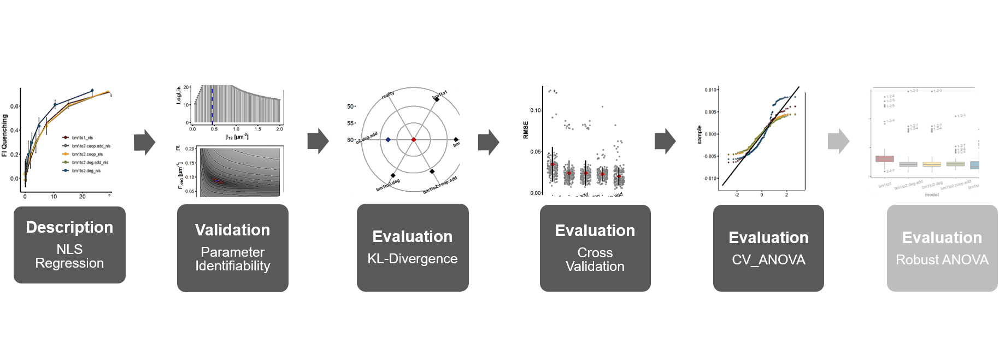

```{css, echo = FALSE}
h1, #TOC>ul>li {
  font-weight: bold;
}

```

```{r setup, include=FALSE}
knitr::opts_chunk$set(echo = TRUE)
knitr::opts_chunk$set(fig.align = 'center')
```

```{r packages, include=TRUE, message=FALSE, warning=FALSE}
library(bookdown)
library(minpack.lm)
library(readxl)
library(dplyr)
library(purrr)
library(tidyr)
library(ggplot2)
library(ggpubr)
library(tibble)
library(ggsci)
library(latex2exp)
library(AICcmodavg)
library(vtreat)
library(kableExtra)
library(broom)
# automatically create a bib database for R packages
knitr::write_bib(c(
  .packages(), 'bookdown', 'knitr', 'rmarkdown'
), 'packages.bib')
```

```{r roadmap, include=TRUE, echo=FALSE, out.width="100%", fig.cap="**Statistical analysis roadmap.** "}

```

# Objective

****
**Model evaluation based on a complete 4-fold CV (see xyz) generated CV-score distributions for each binding model. This allowed for addition of a second dimension to this analysis by further investigating the central tendencies of those distributions by means of analysis of variance (ANOVA). ANOVA is generally used to study the effect that one or more factors might have on the variance in a response variable based on the respective factor means.** 

****

# Methods
## Analysis of Variance (ANOVA){#anova}

* Binding model dependent differences in the central tendencies of CV-scores obtained in \@ref(cv) were further investigated by ANOVA based on a one-way independent and balanced factorial design
* For $m = 5$ category means representing the binding models the multiple regression model containing $J = m - 1$ predictor variables is given by equation \@ref(eq:augmodel):

\begin{equation}
Y_{ij} = \beta_0 + \beta_1X_{1i} + \beta_2X_{2i} + \beta_3X_{3i} + \beta_4X_{4i} + \epsilon_{ij}
(\#eq:augmodel)
\end{equation}

* The set of regression coefficients $\beta_{X_k}$ is associated with a complete set of *a priori* specified orthogonal linear contrasts $\Psi_k$ which are linked via the following relation \@ref(eq:lincont):

\begin{gather}
\beta_{X_k} = \frac{\Psi_k}{\sum\limits_{j=1}^m c_{jk}^2} \quad \text{, where} \\
\Psi_k = \sum\limits_{j=1}^m c_{jk} \bar{Y_j} \notag 
(\#eq:lincont)
\end{gather}

* Where $\bar{Y_j}$ is the respective group mean and $\Psi_k$ is the $k^{th}$ linear contrast ($k = \{1,\dots, J\}$) with contrast coefficients $c_j$ ($j = \{1,\dots, m\}$) which are given by the columns of the contrast coefficient matrix $K$:  
  
\begin{equation}
K =
\begin{bmatrix}
-4/5 & 0 & 0 & 0 \\
 1/5 & 1/4 & -1/3 & -1/2 \\
 1/5 & 1/4 & -1/3 & 1/2 \\
 1/5 & 1/4 & 2/3 & 0 \\
 1/5 & -3/4 & 0 & 0 \\

\end{bmatrix}
(\#eq:contmat)
\end{equation}

* Combining equations \@ref(eq:lincont) and \@ref(eq:contmat), each regression coefficient specifies a distinct difference of group means leading to the null hypotheses ($H_{01} - H_{04}$) expressed in \@ref(eq:hypotheses):

\begin{equation}
\begin{aligned}
H_{01}: \Psi_1 &= 0 \\
\beta_{X_1} &= \left(\frac{\bar{Y}_{bm1to2.deg.add} + \bar{Y}_{bm1to2.deg} + \bar{Y}_{bm1to2.coop.add} + \bar{Y}_{bm1to2.coop}}{4}\right) - \bar{Y}_{bm1to1} = 0 \\
H_{02}: \Psi_2 &= 0 \\
\beta_{X_2} &= \left(\frac{\bar{Y}_{bm1to2.deg.add} + \bar{Y}_{bm1to2.deg} + \bar{Y}_{bm1to2.coop.add}}{3}\right) - \bar{Y}_{bm1to2.coop} = 0 \\
H_{03}: \Psi_3 &= 0 \\
\beta_{X_3} &= \bar{Y}_{bm1to2.coop.add} - \left( \frac{\bar{Y}_{bm1to2.deg.add} + \bar{Y}_{bm1to2.deg}}{2}\right) = 0 \\
H_{04}: \Psi_4 &= 0 \\
\beta_{X_4} &= \frac{\bar{Y}_{bm1to2.deg} - \bar{Y}_{bm1to2.deg.add}}{2} = 0
\end{aligned}
(\#eq:hypotheses)
\end{equation}

* In terms of a model comparison approach, those null hypotheses are expressed by the following compact models $C_1 - C_4$ which are compared to the alternative hypothesis ($H_A$) specified by the augmented model ($ModelA$) given in \@ref(eq:augmodel):

\begin{equation}
\begin{aligned}
H_{01}: Model C1: Y_i &= \beta_0 + \beta_2X_{2i} + \beta_3X_{3i} + \beta_4X_{4i} + \epsilon_i \\
H_{02}: Model C2: Y_i &= \beta_0 + \beta_1X_{1i} + \beta_3X_{3i} + \beta_4X_{4i} + \epsilon_i \\
H_{03}: Model C3: Y_i &= \beta_0 + \beta_1X_{1i} + \beta_2X_{2i} + \beta_4X_{4i} + \epsilon_i \\
H_{04}: Model C4: Y_i &= \beta_0 + \beta_1X_{1i} + \beta_2X_{2i} + \beta_3X_{3i} + \epsilon_i \\
H_A: Model A: Y_i &= \beta_0 + \beta_1X_{1i} + \beta_2X_{2i} + \beta_3X_{3i} + \beta_4X_{4i} + \epsilon_i
\end{aligned}
(\#eq:linearsys)
\end{equation}

* In a first instance, residuals were assumed to be normally and independently distributed with constant variance ($\epsilon_{ij}\overset{iid}{\sim} N(0,\sigma^2)$)
* In this case the $F$-statistic testing the null hypotheses while comparing the variance of the augmented model with the variances of the various contrasts can be represented by equation \@ref(eq:fstat):

\begin{equation}
F = \frac{SSR \times \frac{1}{p_A - p_C}}{SSE_A \times \frac{1}{n - p_A}} = \frac{SSR}{MSE_A}
(\#eq:fstat)
\end{equation}

* $SSR=SSE_{C_i} - SSE_A$ represents the sum of squares that is reduced when a contrast-coded predictor is included in the model
* This is always associated with 1 $df$ determined by the number of parameter in the augmented ($p_A$) and compact ($p_C$) model, respectively
* $SSR$ term can also be derived in closed form via contrasts (equation \@ref(eq:ssr))
* Since a complete set of $m-1$ orthogonal contrasts is used, their individual $SSR$ contributions ($SSR_{C_i}$) sum to $SSR_A$, the sum of squares reduced when the augmented model is used intstead of the simple grand mean model ($Y_{ij} = \beta_0 + \epsilon{ij}$)
* The term $SSE_A$ captures the sum of squared error of the augmented model (see also equation \@ref(eq:ssa)) which leads to the mean square error $MSE_A$ when divided by the appropriate $df$.

\begin{gather}
SSR = SSE_{C_i} - SSE_A = \frac{\Psi_k^2}{\sum\limits_{j=1}^m \frac{c_{jk}^2}{n_k}} \quad \text{, and} \\
SSR_A = \sum\limits_{i=1}^{k} SSR_{C_i} \notag
(\#eq:ssr)
\end{gather}

\begin{gather}
SSE_A =  \sum\limits_{m=1}^k \sum\limits_{i=1}^{n_m} (Y_{mi} - \bar{Y_i}_.)^2 \quad \text{, and} \\
\bar{Y_i}_. = \frac{1}{n_m} \sum\limits_{i=1}^{n_m} Y_{mi} \notag
(\#eq:ssa)
\end{gather}

* At a given nominal significance level $\alpha$ the $F$-statistic was then compared to the critical $F^*_{\alpha;df1,df2}$-statistic having degrees of freedom $df1$ and $df2$ in the numerator and denominator, respectively
* Based on the $F^*_{\alpha;df1,df2}$-statistic 100($1 - \alpha$)% confidence intervals ($CI_{0.95}$) were additionally computed for individual contrasts according to equation \@ref(eq:fci): 

\begin{equation}
CI_{0.95}: \hat{\Psi}_k \pm \sqrt{F^*_{\alpha;df1,df2}} \times \sqrt{MSE_A \times \sum\limits_{j=1}^m \frac{c_{jk}^2}{n_k}}
(\#eq:fci)
\end{equation}

```{r contCI}
contrast.ci <- function(model.lm, level = .05){
  ci_margin <- function(x){
    omega <- sum(x^2 / n)
    err <- sqrt(fcrit * msw * omega)
    err
  }
  rss <- resid(model.lm)
  rssDF <- model.lm$df.residual
  msw <- t(rss) %*% rss  / rssDF
  fcrit <- qf(level, 1, rssDF, lower.tail = FALSE)
  model.coef <- coef(model.lm)[-1]
  #cont_mat <- model.matrix(model.lm)[,-1]
  #N <- dim(cont_mat)[1]
  n <- 220
  csquare <- apply(custom_cont, 2, function(x) sum(x^2))
  ci_mat <- matrix(NA, length(model.coef), 2L,
                   dimnames = list(names(model.coef), c("lower", "upper")))
  cont_se <- apply(custom_cont, 2, ci_margin)
  ci_mat[,1] <- model.coef * csquare - cont_se
  ci_mat[,2] <- model.coef * csquare + cont_se
  ci_mat
}

```

* In a second instance, a robust version of the ANOVA was also conducted specifically addressing the assumption of normally distributed residuals.

# Major Results

* The type of ANOVA used in this study was specifically designed to investigate the binding model as a factor containing five level in a one-way independent factorial design with the use of a complete set of orthogonal linear contrasts (eq. \@ref(eq:contmat))
* This design was formalised as a genral linear regression model ($\overrightarrow{Y} = \overrightarrow{\beta}X + \overrightarrow{\epsilon}$, see eq. \@ref(eq:augmodel))
* Each regression coefficient associated with a contrast coded predictor variable specifies a particular difference of group means on the basis of those linear contrasts
* During ANOVA each contrast is tested against the null hypothesis ($H_0$, eq. \@ref(eq:hypotheses)) via the appropriate $F$-stastic (eq. \@ref(eq:fstat))
* In a first approach the distributional requirements of the residuals in order to use the theoretic $F$-distribution under $H_0$ were assumed to be true
* The summary statistics of the ANOVA are highlighted in table \@ref(tab:anovaTab).  

```{r anova}
compCV.tbl <- readRDS("Output/compCV.rds")
source("Functions/robust_ANOVA.R", local = knitr::knit_global())
source("Functions/ggplot_theme.R", local = knitr::knit_global())

compCV.tbl <- compCV.tbl%>% 
  mutate(fold_class = ifelse(grepl("1-2", fold_points),
                                  "outlier",
                                  "normal"),
         fold_class = factor(fold_class, levels = c("normal", 
                                                    "outlier")))

custom_cont <- matrix(c(-4/5,1/5,1/5,1/5,1/5,
                        0,1/4,1/4,1/4,-3/4,
                        0,-1/3,-1/3,2/3,0,
                        0,-1/2,1/2,0,0), 
                      nrow = 5)
colnames(custom_cont) <- c("k1", "k2", "k3", "k4")
rownames(custom_cont) <- c("bm1to1", "bm1to2.deg.add", 
                      "bm1to2.deg", "bm1to2.coop.add",
                      "bm1to2.coop")
####################LinearReg and ANOVA#####################
contrasts(compCV.tbl$model) <- custom_cont
contrasts(compCV.tbl$fold_class) <- c(1,-1)
compModel.lm <- lm(RMSE ~ 1, data = compCV.tbl)
augModel1.lm <- lm(RMSE ~ model, data = compCV.tbl)
augModel2.lm <- lm(RMSE ~ fold_class + model, data = compCV.tbl)

augModel1.aov <- aov(augModel1.lm)
augModel2.aov <- aov(augModel2.lm)

cont_summary1 <- summary(augModel1.aov,
        split = list(
          model = list(
            k1 = 1, k2 = 2, k3 = 3, k4 = 4)
        ))

####Robust linear Reg and ANOVA #######################
#### Linear Regression
trim <- 0.2
n <- 220
cutoff <- floor(n * trim) 

compCV.trim.tbl<- compCV.tbl %>% 
  group_by(model) %>% 
  arrange(model,RMSE) %>% 
  mutate(index = c(1:220)) %>% 
  filter(index > cutoff & index <= 220 - cutoff) %>%
  dplyr::select(-index) %>% 
  ungroup()

augModel1.trim.lm <- lm(RMSE ~ model, data = compCV.trim.tbl)

#### ANOVA
# bring tidy tibble into list mode
compCV.ls <- compCV.tbl %>% 
  dplyr::select(c(model, RMSE)) %>% 
  mutate(index = rep(c(1:220), times = 5)) %>% 
  pivot_wider(names_from = model, values_from = RMSE) %>% 
  dplyr::select(-index) %>% 
  as.list()

robustComp <- lincon(compCV.ls, custom_cont)
```

```{r anovaTab}
options(knitr.kable.NA = '')

pre <- function(sum.aov){
  nRow <- nrow(sum.aov[[1]][2])
  ssr <- sum.aov[[1]][2][-nRow,]
  sseA <- sum.aov[[1]][2][nRow,]
  pre <- ssr / (ssr + sseA)
  return(pre)
}

#####defining ANOVA summary table####
linconts <- diag(apply(custom_cont, 2, 
                  function(x) augModel1.lm$coefficients[-1] * sum(x^2)))
aov.compModel <- tidy(anova(compModel.lm))
aov.df <- data.frame(Source = c("AugModel", "psi1", "psi2", "psi3", "psi4",
                                "Residuals", "Total"),
                     psihat = c(NA, linconts, NA, NA),
                     df = unlist(c(cont_summary1[[1]][1], 
                                   aov.compModel[1,"df"])),
                     SS = unlist(c(cont_summary1[[1]][2], 
                                       aov.compModel[1,"sumsq"])),
                     MS = unlist(c(cont_summary1[[1]][3], 
                                   aov.compModel[1,"meansq"])),
                     Fstat = unlist(c(cont_summary1[[1]][4],NA)),
                     p = unlist(c(cont_summary1[[1]][5],NA)),
                     PRE = c(pre(cont_summary1), NA, NA))
aov.df <- aov.df %>% 
  mutate(across(where(is.numeric), ~ round(., digits = 4)))
rownames(aov.df) <- c("$Y_{ij} = \\beta_0 + \\beta_1X_1 + \\beta_2X_2 + \\beta_3X_3 + \\beta_4X_4 + \\epsilon_{ij}$",
                      "$Y_{ij} = \\beta_0 + 0 + \\beta_2X_2 + \\beta_3X_3 + \\beta_4X_4 + \\epsilon_{ij}$",
                      "$Y_{ij} = \\beta_0 + \\beta_1X_1 + 0 + \\beta_3X_3 + \\beta_4X_4 + \\epsilon_{ij}$",
                      "$Y_{ij} = \\beta_0 + \\beta_1X_1 + \\beta_2X_2 + 0 + \\beta_4X_4 + \\epsilon_{ij}$",
                      "$Y_{ij} = \\beta_0 + \\beta_1X_1 + \\beta_2X_2 + \\beta_3X_3 + 0 + \\epsilon_{ij}$",
                      "---",
                      "$Y_{ij} = \\beta_0  + \\epsilon_{ij}$")

aov.df %>% 
  kable(caption = "**ANOVA summary table.** Shown is a composite table including summary statistics of the ANOVA but also the estimated contrasts ($\\hat{\\Psi}$) and effect sizes ($\\hat{\\eta}^2$). The $SS$ column represents sums of squares. When the source is the augmented model (\"AugModel\") the $SS$ value represents a reduction in sums of squares ($SSR$) on 4 degrees of freedom ($df$). This is also true for the partitioning of the $SSR$ of the augmented model into $SSR$ components of individual contrasts (\"psi1\"-\"psi4\") based on 1 $df$. When the source is \"Residuals\" the $SS$ value refers to the sum of squared error ($SSE$) of the augmented model and when the source is \" Total\" the $SS$ value refers to the $SSE$ of the grand mean model. In the $MS$ and $F_{stat}$ columns, respectively, corresponding mean squared errors and observed $F$-statistics are listed. The $p$ value represents the conditional probability of observing an $F$-statistic as extreme as computed for this instance or even more extreme. The $\\hat{\\eta}^2$ value represents the proportional reduction in error computed as $\\hat{\\eta}^2 = \\frac{SSR_i}{SSR_i + SSE_A}$, where $SSE_A$ represents the sum of squared error of the augmented model.",      
        col.names = c("$Source$",
                  "$\\hat{\\Psi}$",
                    "$df$",
                    "$SS$",
                    "$MS$",
                    "$F_{stat}$",
                    "$p(\\geq F_{stat})$",
                    "$\\hat{\\eta}^2$")) %>% 
  kable_classic() %>% 
  row_spec(0, background = "grey")
```

A regression analysis of the augmented (complete) model revealed that the type of binding model has an overall statistical effect on the CV-score distribution. CV-score predictions conditional on the binding model factor results in a sum of squared error ($SSE$) of 2.42 $\times$ 10<sup>-1</sup> ("Residuals" in Source column in tab. \@ref(tab:anovaTab)) as opposed to the simple grand mean model the $SSE$ of which amounts to 2.69 $\times$ 10<sup>-1</sup> ("Total" in tab. \@ref(tab:anovaTab)). The resulting reduction in the sums of squares ($SSR$) of 2.74 $\times$ 10<sup>-2</sup> ("AugModel" in Source column) leads to a statistically discernible $F$-statistic ($F_{4,1095}$) of $\sim$ 31. Conditional on a true $H_0$, the probability $p$ of obtaining the observed $F$-statistic or hypothetically more extreme ones is less than 2 $\times$ 10<sup>-16</sup>. The augmented model was estimated to account for a proportional reduction in error (explained variance) of 10.2% as captured by the $\hat{\eta}^2$ value. In order to address more focused hypotheses the $SSR$ of the augmented model was further partitioned into $SSR$ components ("psi1"-"psi4" in tab. \@ref(tab:anovaTab)) attributable to group mean differences as specified by the set of orthogonal linear contrasts.   

The first hypothesis ($H_{01}$ in eq. \@ref(eq:hypotheses)) concerns the first linear contrast ${\Psi}_1$ encoding the difference between the mean CV-score of the `bm1to1` model and the pooled mean CV-score of all tow-site binding models. $H_{01}$ is tested by a focused 1-$df$ model comparison involving the compact model $C1$ (see eq. \@ref(eq:linearsys)) and the augmented model the former of which is obtained by setting $\beta_{X_1} = 0$. This comparison revealed that including the contrast coded predictor in the regression model results in a $SSR$ of 2.52 $\times$ 10<sup>-2</sup> which is statistically supported ($F_{1,1095}$ = 113.9, $p$ < 2 $\times$ 10<sup>-16</sup>). The underlying contrast $\Psi_1$ was estimated as -9.6 $\times$ 10<sup>-3</sup> ($\Psi$ column in tab. \@ref(tab:anovaTab)) and computed to be situated in a compatible range of values from [-1.42 $\times$ 10<sup>-2</sup>, to -9.76 $\times$ 10<sup>-3</sup>] at the 95% confidence level (fig. \@ref(fig:anovaConfint) A). From the total proportional reduction in error due to the augmanted model 9.42% can be attributed to this contrast.
* **Hypothesis $H_{02}$:** 
  + Tests the difference between the observed mean CV-sore of the global `bm1to2.coop` model and the average mean CV-score of the remaining two-site binding models 
  + Consistent with a comparison between compact model $C_2$ ($\beta_{X_2} = 0$) and the augmented model
  + This difference is based on contrast $\hat{\Psi}_2$ which was estimated as 2.61 $\times$ 10<sup>-3</sup> [$CI_{0.95}$: 1.21 $\times$ 10<sup>-3</sup> to 5.75 $\times$ 10<sup>-3</sup>]   + Including $\hat{\Psi}_2$ as a contrast coded predictor variable in the augmented model results in a $SSR$ of 2.0 $\times$ 10<sup>-3</sup> that is statistically supported ($F_{1,1095}$ = 9.03, $p$ = 0.27%)
  + Proportional reduction in error amounts to 0.82%. 
* **Hypothesis $H_{03}$:**
  + Represented by compact model $C_3$ ($\beta_{X_3} = 0$) 
  + Tests for the difference in mean CV-scores between the `bm1to2.coop.add` model and the degenerative models `bm1to2.deg` and `bm1to2.deg.add`, respectively 
  + Statistically not supported
* **Hypothesis $H_{04}$:**
  + Covered by compact model $C_4$ ($\beta_{X_4} = 0$) 
  + Tests for the difference in mean CV-scores between the `bm1to2.deg` and `bm1to2.deg.add` models, respectively
  + Statistically not supported

```{r anovaConfint, fig.height=4, fig.cap="**A: ANOVA residual QQ-plots.** The residuals of the augmented model used to fit the CV-scores conditional on the type of binding model were sorted in ascending order (ordinate) and plotted against the quantiles from a standard normal distribution (abscissa). **B: Interval estimates at the 95% confidence level.** For each contrast (1-4) a 95% confidence interval was computed around the respective least squares point estimate (blue diamonds) based on a common variance term ($MSE_A$, see eq. 2.26) amongst each level of the binding model factor. "}
ci.df <- data.frame(lower = contrast.ci(augModel1.lm)[,1],
                    upper = contrast.ci(augModel1.lm)[,2],
                    contrast = c("1","2","3","4"))

ci.A <- ci.df %>%
  pivot_longer(-contrast,names_to = "bound", values_to = "margin") %>% 
  mutate(coefficient = rep(linconts, each = 2)) %>% 
  ggplot(aes(x = margin, y = contrast))+
  geom_point(size = 2)+
  geom_line(size = 1.0)+
  geom_point(aes(x = coefficient), color = "blue", size = 3, shape = 18)+
  geom_vline(xintercept = 0, lty = 2, size = 1.0,
             color = "red")+
  theme_bw()+
  theme(axis.ticks.length=unit(.07, "cm"))+
  theme(axis.ticks = element_line(colour = "black", size = 1))+
  theme(axis.text.y = element_text(color="black",size = 12))+
  theme(axis.text.x = element_text(color="black",size = 12))+
  theme(axis.title.y = element_text(size = 14,face = "bold"))+
  theme(axis.title.x = element_text(size = 14,face = "bold"))+
  theme(panel.grid.minor.x = element_line(color = "grey80"),
        panel.grid.major.x = element_line(color = "grey80"),
        panel.grid.minor.y = element_blank(),
        panel.grid.major.y = element_blank(),
        panel.border = element_rect(size = 1.2, color = "black"))+
  xlab(TeX("$\\Delta$CV-Score", bold = TRUE))

#### Residual plot#####

resid.A <- 
  augModel1.lm %>% 
  augment() %>% 
  ggplot(aes(sample = .resid))+
  stat_qq(aes(color = model), alpha = 0.7, size = 1.3)+
  stat_qq_line(color = "black", size = 1.3)+
  scale_color_uchicago()+
  mytheme_axes_box+
  theme(legend.title = element_blank(),
        legend.text = element_text(size = 10,
                                   face = "bold"),
        legend.position = c(0.3,0.72))

ggarrange(resid.A, ci.A,
          labels = c("A","B"),
          ncol = 2, nrow = 1)
```

The ANOVA conducted in this way is *inter alia* dependent on certain distributional assumptions about the residuals of the augmented model such as normality and constant variance ($\epsilon_{ij}\overset{iid}{\sim} N(0,\sigma^2)$).
The raw CV-score distributions across the binding models as summarized by the box plots in figure \@ref(fig:cvOutlier)A already highlight a clear violation of the normality assumption. This is due to the presence of outlier causing a bimodal distribution of CV-scores. That departure from normality is confirmed by the QQ-plot of the residuals of the ANOVA model (fig. \@ref(fig:anovaConfint)) especially for the upper tail of the theoretic standard normal distribution ($N(0,1)$). For this reason a robust version of ANOVA was also applied in order to validate the current findings.

# Conclusions

