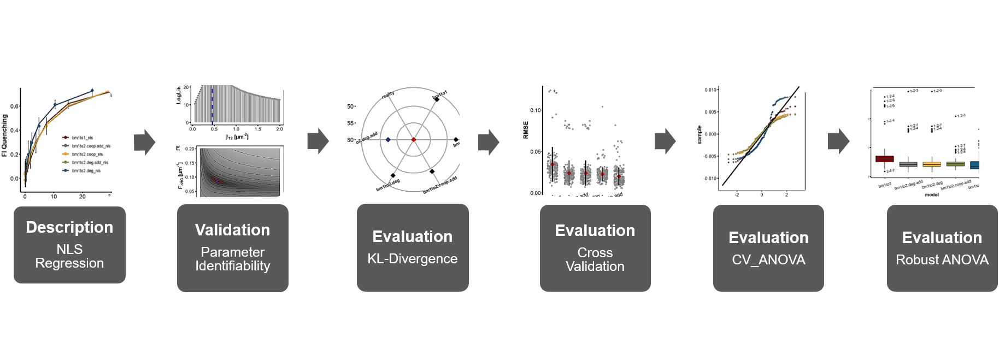

```{css, echo = FALSE}
h1, #TOC>ul>li {
  font-weight: bold;
}

```

```{r setup, include=FALSE}
knitr::opts_chunk$set(echo = TRUE)
knitr::opts_chunk$set(fig.align = 'center')
```

```{r packages, include=TRUE, message=FALSE, warning=FALSE}
library(bookdown)
library(minpack.lm)
library(readxl)
library(dplyr)
library(purrr)
library(tidyr)
library(ggplot2)
library(ggpubr)
library(tibble)
library(ggsci)
library(latex2exp)
library(AICcmodavg)
library(vtreat)
library(kableExtra)
library(broom)
# automatically create a bib database for R packages
knitr::write_bib(c(
  .packages(), 'bookdown', 'knitr', 'rmarkdown'
), 'packages.bib')
```

```{r roadmap, include=TRUE, echo=FALSE, out.width="100%", fig.cap="**Statistical analysis roadmap.** "}

```

# Objective

****
**The ANOVA approach as done in \@ref(resultsanova) is based on specific assumptions about the non-deterministic part of the general linear model such as a homoscedastic and normal distribution of its residuals. The ANOVA model can be made robust against deviations from those assumptions in various ways. In this work, the ANOVA model was specifically made robust against the assumption of normally distributed residuals by using trimmed means.** 

****

# Methods
## Robust ANOVA{#robanova}

* Generic ANOVA was made robust against the violation of the assumption of normally distributed residuals
* This was achieved by using trimmed means following the description of Wilcox [@wilcox11] and using R code provided by the author therein
* When the amount of trimming is denoted by $\gamma$ and the sample size by $n$, then $g$ = $[\gamma n]$, where $[\gamma n]$ is the value of $\gamma n$ rounded down to the nearest integer 
* The trimmed mean $\bar{Y}_t$ of a random sample $Y_1, \cdots, Y_n$ is then computed by removing, respectively, the $g$ smallest and largest observations of the sample while averaging the remaining ones according to equation \@ref(eq:trim):

\begin{equation}
\bar{Y}_t = \frac{Y_{(g+1)} + \cdots + Y_{(n-g)}}{n - 2g}
(\#eq:trim)
\end{equation}

* Where $Y_i$ are the order statistics $Y_{(1)} \leq Y_{(2)} \leq \cdots \leq Y_{(n)}$
* In this work 20% of the observations were trimmed from each tail
* The trimmed mean is used in conjunction with the Winsorized sample variance
* During Winsorization the values of the $g$ smallest observations are set equal to $Y_{(g+1)}$, while the values of the $g$ largest observations are set equal to $Y_{(n−g)}$ according to equation \@ref(eq:winsor)

\begin{equation}
W_i =
\begin{cases}
Y_{(g+1)}, & \text{if} \quad Y_i \leq Y_{(g+1)}\\
Y_i, & \text{if} \quad Y_{(g+1)} < Y_i < Y_{(n-g)}\\
Y_{(n-g)}, & \text{if} \quad Y_i \geq Y_{(n-g)}
\end{cases}
(\#eq:winsor)
\end{equation}

* When $\bar{W}$ represents the Winsorized sample mean then the corresponding Winsorized variance $s_w^2$ is given by equation \@ref(eq:winvar):

\begin{equation}
s_w^2 = \frac{1}{n-1} \sum\limits_{i=1}^n (W_i - \bar{W})^2
(\#eq:winvar)
\end{equation}

* The linear contrast associated with a trimmed mean ($\bar{Y_t}$) is now given by:

\begin{equation}
\Psi_k = \sum\limits_{j=1}^J c_{jk} \bar{Y_{jt}}
(\#eq:trimcont)
\end{equation}

* An estimate for the squared standard error of the $J$ linear contrasts first described by Yuen [@yuen74] takes the following form:

\begin{gather}
s_{yu,k}^2 = \sum\limits_{j=1}^J d_j \quad \text{, where} \\
d_j = \frac{c_{jk}^2(n_j - 1) s_{wj}^2}{h_j(h_j - 1)}
(\#eq:sigmayuen)
\end{gather}

* Here, $h_j$ represents the effective sample size after trimming
* The estimated degrees of freedom $\hat\nu$ associated with the $k$<sup>th</sup> linear contrast is:

\begin{gather}
\hat\nu = \frac{(s_{yu,k}^2)^2}{D} \quad \text{, where} \\
D = \sum\limits_{j=1}^J\frac{d_j^2}{h_j -1}
(\#eq:D)
\end{gather}

* In terms of testing the null hypotheses (e.g., $H_0: \Psi_k = 0$) previously described in \@ref(eq:hypotheses) an appropriate test statistic is now the $T$ statistic according to equation \@ref(eq:T):

\begin{equation}
T_k = \frac{\Psi_k}{\sqrt{s_{yu,k}^2}}
(\#eq:T)
\end{equation}

* $T_k$ was considered significant at the nominal $\alpha$-level if $|T_k| > t_k$, where $t_k$ is the $1 - \alpha$ percentage point of a C-variate studentized maximum modulus distribution with estimated degrees of freedom of $\hat\nu$
* In this way the familywise error rate (FWE) of at least one Type I error among all $J$ tests was kept at the nominal $\alpha$-level
* The corresponding $100(1 - \alpha) \%$ confidence interval was constructed based on equation \@ref(eq:robci):

\begin{equation}
CI_{0.95}:\quad \Psi_k \pm t_k \sqrt{s_{yu,k}^2}
(\#eq:robci)
\end{equation}

```{r studentmodulus}
smmcrit<-function(nuhat,C){
  #
  #  Determine the .95 quantile of the C-variate Studentized maximum
  #  modulus distribution using linear interpolation on inverse
  #  degrees of freedom
  #  If C=1, this function returns the .975 quantile of Student's t
  #  distribution.
  #
  if(C-round(C)!=0)stop("The number of contrasts, C, must be an  integer")
  if(C>=29)stop("C must be less than or equal to 28")
  if(C<=0)stop("C must be greater than or equal to 1")
  if(nuhat<2)stop("The degrees of freedom must be greater than or equal to 2")
  if(C==1)smmcrit<-qt(.975,nuhat)
  if(C>=2){
    C<-C-1
    m1<-matrix(0,20,27)
    m1[1,]<-c(5.57,6.34,6.89,7.31,7.65,7.93,8.17,8.83,8.57,
              8.74,8.89,9.03,9.16,9.28,9.39,9.49,9.59, 9.68,
              9.77,9.85,9.92,10.00,10.07,10.13,10.20,10.26,10.32)
    m1[2,]<-c(3.96,4.43,4.76,5.02,5.23,5.41,5.56,5.69,5.81,
              5.92,6.01,6.10,6.18,6.26,6.33,6.39,6.45,6.51,
              6.57,6.62,6.67,6.71,6.76,6.80,6.84,6.88, 6.92)
    m1[3,]<-c(3.38,3.74,4.01,4.20,4.37,4.50,4.62,4.72,4.82,
              4.89,4.97,5.04,5.11,5.17,5.22,5.27,5.32, 5.37,
              5.41,5.45,5.49,5.52,5.56,5.59,5.63,5.66,5.69)
    m1[4,]<-c(3.09,3.39,3.62,3.79,3.93,4.04,4.14,4.23,4.31,
              4.38,4.45,4.51,4.56,4.61,4.66,4.70,4.74,4.78,
              4.82,4.85,4.89,4.92,4.95,4.98,5.00,5.03,5.06)
    m1[5,]<-c(2.92,3.19,3.39,3.54,3.66,3.77,3.86,3.94,4.01,
              4.07,4.13,4.18,4.23,4.28,4.32,4.36,4.39,4.43,
              4.46,4.49,4.52,4.55,4.58,4.60,4.63,4.65,4.68)
    m1[6,]<-c(2.80,3.06,3.24,3.38,3.49,3.59,3.67,3.74,3.80,
              3.86,3.92,3.96,4.01,4.05,4.09,4.13,4.16,4.19,
              4.22,4.25,4.28,4.31,4.33,4.35,4.38,4.39,4.42)
    m1[7,]<-c(2.72,2.96,3.13,3.26,3.36,3.45,3.53,3.60,3.66,
              3.71,3.76,3.81,3.85,3.89,3.93,3.96,3.99, 4.02,
              4.05,4.08,4.10,4.13,4.15,4.18,4.19,4.22,4.24)
    m1[8,]<-c(2.66,2.89,3.05,3.17,3.27,3.36,3.43,3.49,3.55,
              3.60,3.65,3.69,3.73,3.77,3.80,3.84,3.87,3.89,
              3.92,3.95,3.97,3.99,4.02,4.04,4.06,4.08,4.09)
    m1[9,]<-c(2.61,2.83,2.98,3.10,3.19,3.28,3.35,3.41,3.47,
              3.52,3.56,3.60,3.64,3.68,3.71,3.74,3.77,3.79,
              3.82,3.85,3.87,3.89,3.91,3.94,3.95, 3.97,3.99)
    m1[10,]<-c(2.57,2.78,2.93,3.05,3.14,3.22,3.29,3.35,3.40,
               3.45,3.49,3.53,3.57,3.60,3.63,3.66,3.69,3.72,
               3.74,3.77,3.79,3.81,3.83,3.85,3.87,3.89,3.91)
    m1[11,]<-c(2.54,2.75,2.89,3.01,3.09,3.17,3.24,3.29,3.35,
               3.39,3.43,3.47,3.51,3.54,3.57,3.60,3.63,3.65,
               3.68,3.70,3.72,3.74,3.76,3.78,3.80,3.82,3.83)
    m1[12,]<-c(2.49,2.69,2.83,2.94,3.02,3.09,3.16,3.21,3.26,
               3.30,3.34,3.38,3.41,3.45,3.48,3.50,3.53,3.55,
               3.58,3.59,3.62,3.64,3.66,3.68,3.69,3.71,3.73)
    m1[13,]<-c(2.46,2.65,2.78,2.89,2.97,3.04,3.09,3.15,3.19,
               3.24,3.28,3.31,3.35,3.38,3.40,3.43,3.46,3.48,
               3.50,3.52,3.54,3.56,3.58,3.59,3.61,3.63,3.64)
    m1[14,]<-c(2.43,2.62,2.75,2.85,2.93,2.99,3.05,3.11,3.15,
               3.19,3.23,3.26,3.29,3.32,3.35,3.38,3.40,3.42,
               3.44,3.46,3.48,3.50,3.52,3.54,3.55,3.57,3.58)
    m1[15,]<-c(2.41,2.59,2.72,2.82,2.89,2.96,3.02,3.07,3.11,
               3.15,3.19,3.22,3.25,3.28,3.31,3.33,3.36,3.38,
               3.39,3.42,3.44,3.46,3.47,3.49,3.50,3.52,3.53)
    m1[16,]<-c(2.38,2.56,2.68,2.77,2.85,2.91,2.97,3.02,3.06,
               3.09,3.13,3.16,3.19,3.22,3.25,3.27,3.29,3.31,
               3.33,3.35,3.37,3.39,3.40,3.42,3.43,3.45,3.46)
    m1[17,]<-c(2.35,2.52,2.64,2.73,2.80,2.87,2.92,2.96,3.01,
               3.04,3.07,3.11,3.13,3.16,3.18,3.21,3.23,3.25,
               3.27,3.29,3.30,3.32,3.33,3.35,3.36,3.37,3.39)
    m1[18,]<-c(2.32,2.49,2.60,2.69,2.76,2.82,2.87,2.91,2.95,
               2.99,3.02,3.05,3.08,3.09,3.12,3.14,3.17, 3.18,
               3.20,3.22,3.24,3.25,3.27,3.28,3.29,3.31,3.32)
    m1[19,]<-c(2.29,2.45,2.56,2.65,2.72,2.77,2.82,2.86,2.90,
               2.93,2.96,2.99,3.02,3.04,3.06,3.08,3.10, 3.12,
               3.14,3.16,3.17,3.19,3.20,3.21,3.23,3.24,3.25)
    m1[20,]<-c(2.24,2.39,2.49,2.57,2.63,2.68,2.73,2.77,2.79,
               2.83,2.86,2.88,2.91,2.93,2.95,2.97,2.98, 3.01,
               3.02,3.03,3.04,3.06,3.07,3.08,3.09,3.11,3.12)
    if(nuhat>=200)smmcrit<-m1[20,C]
    if(nuhat<200){
      nu<-c(2,3,4,5,6,7,8,9,10,11,12,14,16,18,20,24,30,40,60,200)
      temp<-abs(nu-nuhat)
      find<-order(temp)
      if(temp[find[1]]==0)smmcrit<-m1[find[1],C]
      if(temp[find[1]]!=0){
        if(nuhat>nu[find[1]]){
          smmcrit<-m1[find[1],C]-
            (1/nu[find[1]]-1/nuhat)*(m1[find[1],C]-m1[find[1]+1,C])/
            (1/nu[find[1]]-1/nu[find[1]+1])
        }
        if(nuhat<nu[find[1]]){
          smmcrit<-m1[find[1]-1,C]-
            (1/nu[find[1]-1]-1/nuhat)*(m1[find[1]-1,C]-m1[find[1],C])/
            (1/nu[find[1]-1]-1/nu[find[1]])
        }
      }}
  }
  smmcrit
}

qsmm<-function(q, r, nu) {
  #r=number of comparisons
  if (!is.finite(nu)) 
    return(qnorm(1 - 0.5 * (1 - q^(1/r))))
  res = uniroot(function(c, r, nu, q) {
    psmm(c, r = r, nu = nu) - q
  },
  c(0, 100), r = r, nu = nu, q = q)
  res$root
}


psmm = function(x, r, nu) {
  res = integrate(psmm.x, 0, Inf, c = x, r = r, nu = nu)
  res$value
}


psmm.x=function(x, c, r, nu) {
  snu = sqrt(nu)
  sx = snu * x
  lgx = log(snu) - lgamma(nu/2) + (1 - nu/2) * log(2) + 
    (nu - 1) * log(sx) + (-sx^2/2)
  exp(r * log(2 * pnorm(c * x) - 1) + lgx)
}

```

```{r winvar}
winvar <- function(x,tr=.2){
  y <- sort(x)
  n <- length(x)
  ibot <- floor(tr*n)+1
  itop <- length(x)-ibot+1
  xbot <- y[ibot]
  xtop <- y[itop]
  y <- ifelse(y<=xbot,xbot,y)
  y <- ifelse(y>=xtop,xtop,y)
  wv <- var(y)
  wv
}


listm<-function(x){
  #
  # Store the data in a matrix or data frame in a new
  # R variable having list mode.
  # Col 1 will be stored in y[[1]], col 2 in y[[2]], and so on.
  #
  if(is.null(dim(x)))stop("The argument x must be a matrix or data frame")
  y<-list()
  for(j in 1:ncol(x))y[[j]]<-x[,j]
  y
}

```

```{r lincon}
lincon<-function(x,con=0,tr=.2,alpha=.05,pr=FALSE){
  #
  #  A heteroscedastic test of d linear contrasts using trimmed means.
  #
  #  This version uses an improved method for computing the quantiles of a
  #  Studentized maximum modulus distriburtion
  # 
  #  The data are assumed to be stored in $x$ in list mode, a matrix
  #  or a data frame. If in list mode,
  #  length(x) is assumed to correspond to the total number of groups.
  #  It is assumed all groups are independent.
  #
  #  con is a J by d matrix containing the contrast coefficients that are used.
  #  If con is not specified, all pairwise comparisons are made.
  #
  #  Missing values are automatically removed.
  #
  #  pr=FALSE included to avoid errors using an earlier version of this function when
  #   dealing with two-way and higher designs
  #
  #  Adjusted p-values are based on the Studentized maximum modulus distribution with the 
  #  goal of controlling FWE
  #
  #  To apply the Kaiser-Bowden method, use the function kbcon
  #
  if(tr==.5) stop('Use the R function medpb to compare medians')
  if(is.data.frame(x)) x = as.matrix(x)
  if(is.matrix(x)) x <- listm(x)
  if(!is.list(x))stop('Data must be stored in a matrix or in list mode.')
  con<-as.matrix(con)
  J<-length(x)
  sam=NA
  h<-vector('numeric',J)
  w<-vector('numeric',J)
  xbar<-vector('numeric',J)
  for(j in 1:J){
    xx<-!is.na(x[[j]])
    val<-x[[j]]
    x[[j]]<-val[xx]  # Remove missing values
    sam[j]=length(x[[j]])
    h[j]<-length(x[[j]])-2*floor(tr*length(x[[j]]))
    # h is the number of observations in the jth group after trimming.
    w[j]<-((length(x[[j]])-1)*winvar(x[[j]],tr))/(h[j]*(h[j]-1))
    xbar[j]<-mean(x[[j]],tr)
  }
  if(sum(con^2)==0){
    CC<-(J^2-J)/2
    psihat<-matrix(0,CC,9)
    dimnames(psihat)<-list(NULL,c('Group','Group','psihat','ci.lower','ci.upper',
                                  'p.value','Est.1','Est.2','adj.p.value'))
    test<-matrix(NA,CC,6)
    dimnames(test)<-list(NULL,c('Group','Group','test','crit','se','df'))
    jcom<-0
    for (j in 1:J){
      for (k in 1:J){
        if (j < k){
          jcom<-jcom+1
          test[jcom,3]<-abs(xbar[j]-xbar[k])/sqrt(w[j]+w[k])
          sejk<-sqrt(w[j]+w[k])
          test[jcom,5]<-sejk
          psihat[jcom,1]<-j
          psihat[jcom,2]<-k
          test[jcom,1]<-j
          test[jcom,2]<-k
          psihat[jcom,3]<-(xbar[j]-xbar[k])
          df<-(w[j]+w[k])^2/(w[j]^2/(h[j]-1)+w[k]^2/(h[k]-1))
          test[jcom,6]<-df
          psihat[jcom,6]<-2*(1-pt(test[jcom,3],df))
          psihat[jcom,7]=xbar[j]
          psihat[jcom,8]=xbar[k]
          crit=qsmm(1-alpha,CC,df)
          test[jcom,4]<-crit
          psihat[jcom,4]<-(xbar[j]-xbar[k])-crit*sejk
          psihat[jcom,5]<-(xbar[j]-xbar[k])+crit*sejk
          psihat[jcom,9]=1-psmm(test[jcom,3],CC,df)
        }}}}
  if(sum(con^2)>0){
    if(nrow(con)!=length(x)){
      stop('The number of groups does not match the number of contrast coefficients.')
    }
    CC=ncol(con)
    psihat<-matrix(0,ncol(con),6)
    dimnames(psihat)<-list(NULL,c('con.num','psihat','ci.lower','ci.upper',
                                  'p.value','adj.p.value'))
    test<-matrix(0,ncol(con),5)
    dimnames(test)<-list(NULL,c('con.num','test','crit','se','df'))
    df<-0
    for (d in 1:ncol(con)){
      psihat[d,1]<-d
      psihat[d,2]<-sum(con[,d]*xbar)
      sejk<-sqrt(sum(con[,d]^2*w))
      test[d,1]<-d
      test[d,2]<-sum(con[,d]*xbar)/sejk
      df<-(sum(con[,d]^2*w))^2/sum(con[,d]^4*w^2/(h-1))
      crit=qsmm(1-alpha,CC,df)
      test[d,3]<-crit
      test[d,4]<-sejk
      test[d,5]<-df
      psihat[d,3]<-psihat[d,2]-crit*sejk
      psihat[d,4]<-psihat[d,2]+crit*sejk
      psihat[d,5]<-2*(1-pt(abs(test[d,2]),df))
      psihat[d,6]=1-psmm(abs(test[d,2]),CC,df)
    }
  }
  list(n=sam,test=test,psihat=psihat)
}

```

# Major Results

The ANOVA approach as done in \@ref(resultsanova) is based on specific assumptions about the non-deterministic part of the general linear model such as a homoscedastic and normal distribution of its residuals. The ANOVA model can be made robust against deviations from those assumptions in various ways. In this work, the ANOVA model was specifically made robust against the assumption of normally distributed residuals by using trimmed means as outlined in \@ref(robanova).


The basic strategy was to replace, respectively, the mean and variance of the CV-score distributions of the binding models with 20% trimmed means (eq. \@ref(eq:trim)) and the corresponding Winsorized variances (eq. \@ref(eq:winvar)). This replacement necessitated adjustments for the computation of the mean squared error (eq. \@ref(eq:sigmayuen)) and the degrees of freedom (eq. \@ref(eq:D)) which were in part due to the use of effective sample sizes ($h$) after trimming. The $F$-statistic was replaced by an appropriate $T$-statistic(eq. \@ref(eq:T)). Table \@ref(tab:anovaRobTab) summarizes the robust ANOVA. 

```{r anovaRobTab}
source("Functions/ggplot_theme.R", local = knitr::knit_global())
custom_cont <- matrix(c(-4/5,1/5,1/5,1/5,1/5,
                        0,1/4,1/4,1/4,-3/4,
                        0,-1/3,-1/3,2/3,0,
                        0,-1/2,1/2,0,0), 
                      nrow = 5)
trim <- 0.2
n <- 220
cutoff <- floor(n * trim)

compCV.tbl <- readRDS("Output/compCV.rds")

compCV.trim.tbl<- compCV.tbl %>% 
  group_by(model) %>% 
  arrange(model,RMSE) %>% 
  mutate(index = c(1:220)) %>% 
  filter(index > cutoff & index <= 220 - cutoff) %>%
  dplyr::select(-index) %>% 
  ungroup()

augModel1.trim.lm <- lm(RMSE ~ model, data = compCV.trim.tbl)

#### ANOVA
# bring tidy tibble into list mode
compCV.ls <- compCV.tbl %>% 
  dplyr::select(c(model, RMSE)) %>% 
  mutate(index = rep(c(1:220), times = 5)) %>% 
  pivot_wider(names_from = model, values_from = RMSE) %>% 
  dplyr::select(-index) %>% 
  as.list()

robustComp <- lincon(compCV.ls, custom_cont)

rob.ci.df <- data.frame(Source = c("1", "2", "3", "4"),
                        psihat = c(robustComp$psihat[,2]),
                        df = robustComp$test[,5],
                        se = robustComp$test[,4],
                        tstat = robustComp$test[,2],
                        p = robustComp$psihat[,6])
rob.ci.df %>% 
  kable(caption = "**Robust ANOVA summary table.** In the $\\Psi$ column estimated contrast point estimates are presented. $df$-values represent estimated degrees of freedom based on effective sample sizes after trimming and taking into account a trimmed t-distribution. Respective mean squared errors ($s_{yu}^2$) were computed according to Yuen. The $p$-value is adjusted for multiple testing by referring to the C-variate studentized maximum modulus distribution.",      col.names = c("$Source$",
                  "$\\hat{\\Psi}$",
                    "$df$",
                  "$s_{yu}^2$",
                    "$T_{stat}$",
                    "$p_{adj}(\\geq T_{stat})$")) %>% 
  kable_classic() %>% 
  row_spec(0, background = "grey") 


```

During the robust ANOVA approach, the same hypotheses as in \@ref(resultsanova) were tested which were then involving linear contrasts based on trimmed CV-score distribution means. For instance, the first hypothesis $H_{01}$ tests the difference between the trimmed mean CV-score of the `bm1to1` model and the average trimmed mean CV-score of all two-site binding models. This difference is based on linear contrast $\Psi_1$ which was estimated as -7.98 $\times$ 10<sup>-3</sup> and which leads to a statistically discernible $T$-statistic of -17.1 as indicated by the corresponding adjusted $p$ value ($p_{adj}$). The $CI_{95}$ (eq. \@ref(eq:robci)) of $\Psi_1$ and those for all other contrasts are shown in figure \@ref(fig:anovaRob)B and are in support of those determined in the non-robust ANOVA approach. Due to the trimming, the observed distribution of the residuals of the ANOVA model is more consistent with that of a theoretic standard normal distribution as highlighted in figure \@ref(fig:anovaRob)A.

```{r anovaRob, fig.height=4, fig.cap="**A: Robust ANOVA residual QQ-Plots.** The residuals of the augmented model used to fit the 20% trimmed CV-scores conditional on the type of binding model were sorted in ascending order (ordinate) and plotted against the quantiles from a standard normal distribution. **B: Interval estimates at the 95% confidence level.** For each contrast (1-4) a 95% confidence interval was determined based on Yuen's mean squared error ($s_{yu}^2$). "}

ci.rob.df <- data.frame(lower = robustComp$psihat[,3],
                        upper = robustComp$psihat[,4],
                        contrast = c("1","2","3","4"))

ci.B <- ci.rob.df %>% 
  pivot_longer(-contrast,names_to = "bound", values_to = "margin") %>% 
  mutate(coefficient = rep(robustComp$psihat[,2], each = 2)) %>% 
  ggplot(aes(x = margin, y = contrast))+
  geom_point(size = 2)+
  geom_line(size = 1.0)+
  geom_point(aes(x = coefficient), color = "blue", size = 3, shape = 18)+
  geom_vline(xintercept = 0, lty = 2, size = 1.0,
             color = "red")+
  theme_bw()+
  theme(axis.ticks.length=unit(.07, "cm"))+
  theme(axis.ticks = element_line(colour = "black", size = 1))+
  theme(axis.text.y = element_text(color="black",size = 12))+
  theme(axis.text.x = element_text(color="black",size = 12))+
  theme(axis.title.y = element_text(size = 14,face = "bold"))+
  theme(axis.title.x = element_text(size = 14,face = "bold"))+
  theme(panel.grid.minor.x = element_line(color = "grey80"),
        panel.grid.major.x = element_line(color = "grey80"),
        panel.grid.minor.y = element_blank(),
        panel.grid.major.y = element_blank(),
        panel.border = element_rect(size = 1.2, color = "black"))+
  xlab(TeX("$\\Delta$CV-Score", bold = TRUE))

####residual plot####
resid.B <- augModel1.trim.lm %>% 
  augment() %>% 
  ggplot(aes(sample = .resid))+
  stat_qq(aes(color = model), alpha = 0.7, size = 1.3)+
  stat_qq_line(color = "black", size = 1.3)+
  scale_color_uchicago()+
  mytheme_axes_box+
  theme(legend.title = element_blank(),
        legend.text = element_text(size = 10,
                                   face = "bold"),
        legend.position = "none")

ggarrange(resid.B, ci.B,
          labels = c("A","B"),
          ncol = 2, nrow = 1)
```

# Conclusions

Following the generic ANOVA, involved statistics were determined conditional on a true null hypothesis which imposes some distributional assumptions on the residuals of the general linear model. For instance, the residuals should be homoscedastic and normally distributed. Also, there should be no additional source of error besides random measurement error. However, as already discussed in \@ref(specDisc) there is an increasing measurement uncertainty in the titration data in relation to an increasing dilution factor of the tRNA. As a result, the data in the lowest concentration range including data points one and two introduce systematic error in the CV-ANOVA due to the fact that they are especially prevalent amongst the train fold combinations that lead to CV-score outlier. It is due to these outlier that the CV-score distributions are bimodal. Also, though not statistically investigated but phenomenologically observed, the `bm1to1` model seems to be more affected by the presence of outlier than the two-site binding models. As a result of this departure from the normality assumption and due to the fact that the homoscedasticity assumption about the residuals still holds, a robust ANOVA was applied on the basis of trimmed CV-score distributions. Determined robust effect sizes of the contrasts (cf. tab \@ref(tab:anovaRobTab)) as well as additionally computed interval estimates (cf. fig \@ref(fig:anovaRob)) are in support of the corresponding estimates previously determined under the generic ANOVA approach.    

# Summary of the Complete Analysis

In the course of this work a chimeric s<sup>4</sup>U8 synthesizing complex was investigated comprising *T. maritima* ThiI and *B. subtilis* tRNA<sup>Phe</sup>. 
Currently, the only structural information available about complexes of this system and in general is the crystal structure of the binary complex formed between ThiI<sub>Tm</sub> and TPHE39A which represents a truncated version of tRNA<sup>Phe</sup> still biologically active. These structures reveal that each monomer of dimeric ThiI<sub>Tm</sub> binds one TPHE39A substrate. However, it remains elusive whether this 1:2 stoichiometry can be extended to complexes of ThiI<sub>Tm</sub> and full-length tRNA substrates. For this reason, the stoichiometry of the complex was re-investigated in this work in terms of fluorescence spectroscopic binding studies using the interaction between ThiI<sub>Tm</sub> and full-length tRNA$\mathrm{^{Phe}_{Bs}}$ as an example. Following this, an analytic work flow was established on the basis of which it is possible to infer the information about the stoichiometry from ThiI<sub>Tm</sub>•tRNA$\mathrm{^{Phe}_{Bs}}$ binding profiles in the context of a multi-model approach by statistical comparison of a set of variably parameterized binding models all related to underlying 1:1 or 1:2 binding equilibria.


Starting with ordinary nls regression analysis the descriptive strength of each binding model in capturing the spectroscopic titration profile could be verified. Ater that, the model set was validated based on maximum likelihood profiling of model parameter. This important analysis step was used to monitor whether the sets of binding model specific parameter are uniquely identified by implicitly taking into account the noise level in the data, the domain restrictions of binding model functions due to lower and upper practical concentration limits, and model complexity. It revealed that the cooperative binding models show, respectively, structural and practical non-identifiability with respect to single parameter so that these models are currently not appropriately parameterized with respect to the information content in the data set. Binding model performance was then firstly evaluated by KL divergence analysis based on $AIC_c$-scores which take into account model complexity. The united weight of evidence of all two-site binding models determined during this analysis step provide relatively strong support that the actual KL best model is among this sub-set. Binding model performance was secondly evaluated based on CV-scores taking into account predictive power. The contrast analysis in the context of the generic ANOVA approach revealed that on average the one-site `bm1to1` binding model yields statistically higher CV-scores than the two-site binding models which underpins the findings of the KL divergence analysis. The results of the generic ANOVA approach were subsequently supported by a robust ANOVA approach dealing with systematic measurement error induced departure of CV-score distributions from normality by using trimmed distributions.    


Overall results from the complete analysis workflow provide evidence that the underlying stoichiometry of complexes between ThiI and its full-length tRNA substrates as determined in place of the chimeric ThiI<sub>Tm</sub>•tRNA$\mathrm{^{Phe}_{Bs}}$ complex in the present work is indeed a 1:2 stoichiometry. The currently best approximating binding model of the ThiI<sub>Tm</sub>•tRNA$\mathrm{^{Phe}_{Bs}}$ interaction profile relating this stoichiometry to an appropriate underlying binding equilibrium is the `bm1to2.deg.add` model. This model describes binding of two tRNA$\mathrm{^{Phe}_{Bs}}$ ligands to degenerate binding sites of ThiI<sub>Tm</sub> based on an overall stability constant $\beta_{12}$. The `bm1to2.deg.add` model thereby meets the requirements of three quantifiable prime criteria featuring a good model: It is adequately descriptive and, taking into account model complexity, best fits the ThiI<sub>Tm</sub>•tRNA$\mathrm{^{Phe}_{Bs}}$ binding profile in the simplest possible manner among the two-site binding models of the Adair-Klotz-type as well as it is comparatively generalizable. It therefore provides a solid current working hypothesis.

However, it has to be stressed that the results of this work are just first insights based on a preliminary experimental set up and data set. Ultimately, more biological replications are going to be needed based on an improved experimental set up concerning the applied concentration range, and the number of data points. This improvement is going to allow for a more robust direct comparison of binding models but also for a meta-analytic statistical analysis of CV-score distributions. 


# References